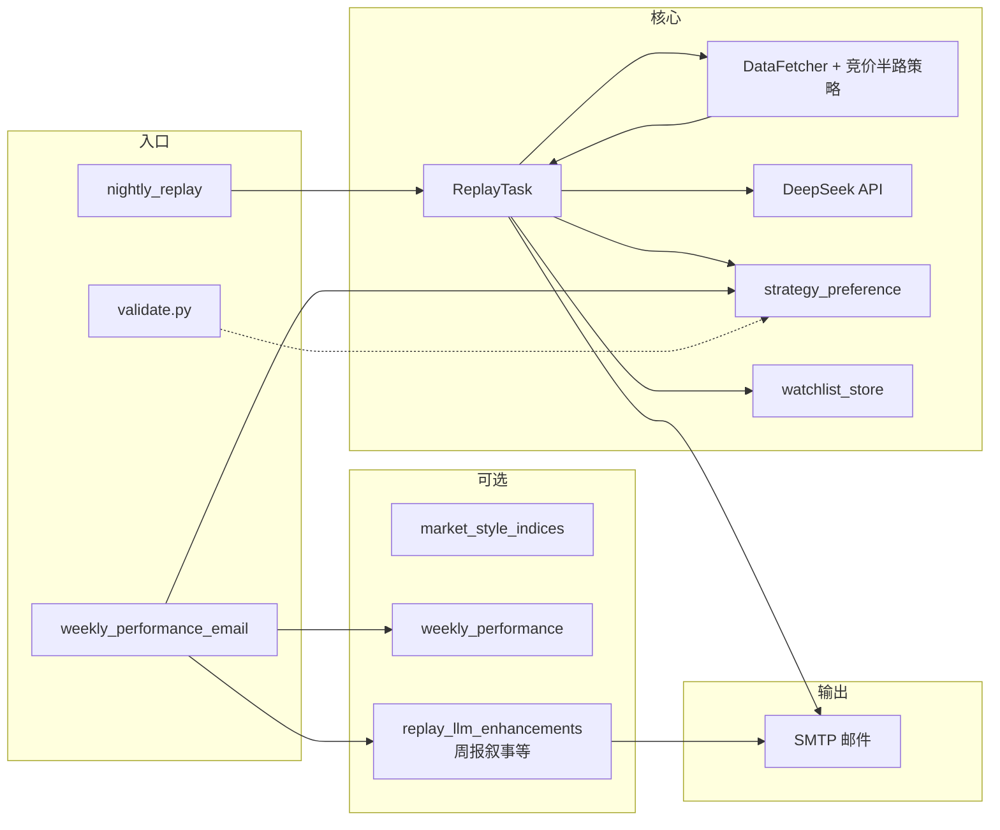

# 架构与技术说明

**文档性质**：本仓库「次日竞价半路」复盘系统的**逻辑架构、模块边界、数据契约与运维要点**。  
**读者**：维护者、二次开发者；实现细节以源码为准，本文作导航与约定。  
**时效**：与主分支实现同步更新；若行为与文档冲突，以代码与单元测试为准。

---

## 目录

1. [一句话与核心原则](#1-一句话与核心原则)  
2. [系统目标与非目标](#2-系统目标与非目标)  
3. [技术栈与运行时](#3-技术栈与运行时)  
4. [逻辑架构总览](#4-逻辑架构总览)  
&nbsp;&nbsp;&nbsp;4.1 [企业级六层架构（演进目标）](#41-企业级六层架构演进目标)  
5. [模块与目录映射](#5-模块与目录映射)  
6. [配置体系](#6-配置体系)  
7. [单次复盘流水线](#7-单次复盘流水线)  
8. [策略偏好与周度闭环](#8-策略偏好与周度闭环)  
9. [入口（脚本，无 Web）](#9-入口脚本无-web)  
10. [数据文件与契约](#10-数据文件与契约)  
11. [脚本与定时任务](#11-脚本与定时任务)  
12. [CI 与质量保障](#12-ci-与质量保障)  
13. [安全、密钥与合规提示](#13-安全密钥与合规提示)  
14. [排错与常见情况](#14-排错与常见情况)  
15. [术语表](#15-术语表)  
16. [已知局限与路线图](#16-已知局限与路线图)  
17. [附录：环境变量（节选）](#17-附录环境变量节选)  
18. [文档维护约定](#18-文档维护约定)

---

## 1. 一句话与核心原则

> **程序算清量，模型写得像。**

- **程序侧**：交易日历、行情与规则、龙头池打分与标签、持久化与权重更新。  
- **模型侧**：在固定章节结构下生成可读 Markdown，不替代程序数据与风控责任。  
- **时间口径**：业务日期若无特殊说明，均为 **A 股交易日**；脚本中的「北京时间」用于定时任务说明。

---

## 2. 系统目标与非目标

### 2.1 目标

| 能力 | 说明 |
|------|------|
| 收盘复盘 | 拉取数据，生成结构化市场摘要与龙头池，调用 DeepSeek 输出长文。 |
| 档案沉淀 | 将**程序产出的**龙头池写入本地，与 AI 正文解耦。 |
| 周度统计 | 按自然周与约定收益口径计算区间表现与标签归因。 |
| 策略反馈 | 用历史收益更新「五桶」风格权重，供下一交易日 prompt 侧重。 |
| 可选能力 | 风格指数持久化、周报邮件、权重演进图、CI 校验等。 |

### 2.2 非目标（边界）

- 不提供实盘下单接口，不保证收益；不构成投资建议。  
- 不对第三方数据源（如 akshare）的准确性、实时性作担保。  
- **GitHub Actions 托管 Runner** 不持久化仓库内 `data/` 下的状态文件；依赖本地状态的定时任务应在**本机、NAS 或自托管 Runner** 上运行。

---

## 3. 技术栈与运行时

- **语言**：Python 3（CI 使用 3.11，本地建议 3.10+）。  
- **入口**：命令行脚本 `scripts/*.py`（`run.py` 仅提示已移除 Web）。  
- **数据**：pandas、akshare（行情与交易日历）。  
- **模型**：DeepSeek Chat Completions（HTTP，`requests`）。  
- **邮件**：SMTP，`markdown` 渲染 HTML 正文。  
- **测试**：`pytest`；**校验**：`scripts/validate.py`。

**依赖清单**：见项目根 `requirements.txt`。

---

## 4. 逻辑架构总览

下图从**入口**到**输出**展示主要依赖关系（周报为并行入口）。

### 4.1 企业级六层架构（演进目标）

当前实现仍高度耦合在 `app/services/*` 与少数大模块中（数据、策略、LLM、邮件同路径交织）。**目标形态**为六层：**接口层 Adapter → 领域 Domain → 应用服务 Application → 编排 Orchestration → 输出 Output → 基础设施 Infra**，使换数据源、换 LLM、换推送时**编排与领域规则保持稳定**。

- **完整定义、依赖规则、与现有代码映射、分阶段迁移**：见 **`docs/six_layer_architecture.md`**。  
- **包骨架**（新代码优先落位）：`app/adapters/`、`app/domain/`、`app/application/`、`app/orchestration/`、`app/output/`、`app/infrastructure/`（各含 `__init__.py` 说明）。历史包名 **`app/services`** 渐进搬迁，不一次性重命名全仓库。

---

## 5. 模块与目录映射

| 位置 | 职责摘要 |
|------|----------|
| `app/__init__.py` | 包初始化（无 Web）。 |
| `app/adapters/`、`app/domain/`、`app/application/`、`app/orchestration/`、`app/output/`、`app/infrastructure/` | **六层架构占位**（演进目标，见 `docs/six_layer_architecture.md`）；与 `app/services` 并存。 |
| `app/services/replay_llm_enhancements.py` | 周报周度叙事、权重白话解释等；**日度 `ReplayTask` 已不再拼接**复盘增强 bundle（函数仍保留）。 |
| `app/services/data_fetcher.py` | 行情/日历/板块等；组装 `get_market_summary`，写入 `_last_auction_meta`。 |
| `app/services/auction_halfway_strategy.py` | 主线与龙头池逻辑；`meta.top_pool` 含 `close` 等字段。 |
| `app/services/replay_task.py` | 单次复盘编排：prompt、大模型（默认 DeepSeek）、存档、风格探测、邮件通知。 |
| `app/services/strategy_preference.py` | 五桶权重、周度更新、evolution 日志、稳定性探测、绘图、异常检测。 |
| `app/services/watchlist_store.py` | `watchlist_records.json` 线程安全读写。 |
| `app/services/weekly_performance.py` | 区间收益、周报 Markdown、自然月段落。 |
| `app/services/weekly_market_snapshot.py` | 周报市场快照数据与格式化。 |
| `app/services/market_style_indices.py` | 打板/趋势/低吸等指数计算与 JSON 持久化。 |
| `app/services/email_notify.py` | `resolve_email_config`、`send_report_email`、`send_simple_email`。 |
| `app/services/llm_client.py` | OpenAI 兼容 Chat Completions（DeepSeek）；`get_llm_client`。 |
| `app/utils/config.py` | `DEFAULT_CONFIG` 与 `replay_config.json` 合并（`ConfigManager`）。 |
| `scripts/` | 夜间复盘、周报、校验、回测占位。 |
| `tests/` | 单元测试与回归。 |
| `.github/workflows/` | CI、定时任务、部署等。 |
| `data/` | 运行时数据目录（部分文件建议不入库）。 |

---

## 6. 配置体系

### 6.1 加载规则

1. 默认：`app/utils/config.py` 中 **`DEFAULT_CONFIG`**。  
2. 若存在 **`replay_config.json`**（项目根），与用户 JSON **浅合并**（用户键覆盖默认键）。  
3. **环境变量**：`DEEPSEEK_API_KEY`、SMTP、收件人等常以环境变量覆盖配置文件，具体见 `resolve_email_config` 与各脚本。

### 6.2 与业务强相关的键（节选）

完整列表以 `DEFAULT_CONFIG` 为准；下表为阅读文档时常用项。

| 键 | 含义 |
|----|------|
| `enable_finance_news` | 是否拉取并拼接财联社要闻摘要。 |
| `enable_style_stability_probe` | 主报告前是否增加一次大模型「风格稳定性」轻量调用（**默认 false**，与主长文各计一次请求，易触发 429；需要时在 `replay_config.json` 设为 `true`）。 |
| `replay_llm_spacing_sec` | 启用风格探测时，探测结束后再等待的秒数，再请求主长文（默认 15）。 |
| `enable_daily_style_indices_persist` | 复盘成功后是否写入 `market_style_indices.json`。 |
| `enable_strategy_feedback_loop` | 周末脚本是否调用 `update_from_recent_returns`。 |
| `enable_weekly_performance_email` | 是否发送周报邮件。 |
| `enable_weekly_ai_insight` | 周报是否调用大模型写「风格诊断」。 |
| `enable_weekly_weight_anomaly_email` | 权重异常是否单独发信。 |
| `use_multi_week_decay_for_strategy` 等 | 多周衰减、平滑、单桶上下限、周间变动惩罚等（策略偏好）。 |

### 6.3 复盘目录与摘要（节选）

| 键 | 含义 |
|----|------|
| `enable_replay_lhb_catalog` | 篇首目录是否请求龙虎榜东财接口。 |
| `enable_replay_concept_fund_snapshot` | 是否拉取概念主力净流入 TOP（与行业榜并列）。 |
| `enable_replay_watchlist_snapshot` | 是否生成程序龙头池档案表（`watchlist_records.json`）。 |
| `replay_watchlist_max_rows` / `replay_watchlist_monitor_span` | 档案最大行数、监控窗口交易日数。 |
| `enable_replay_watchlist_spot_followup` | 档案下是否附池内代码的 5 日/今日快照表。 |
| `replay_watchlist_spot_followup_max_codes` | 快照表最多代码数。 |
| `enable_replay_spot_5d_leaderboard` / `replay_spot_5d_top_n` | 全 A 五日涨幅榜开关与 TOP N。 |
| `enable_replay_checkpoint` / `resume_replay_if_available` | 断点落盘与续跑；`meta.json` 含 `zt_pool_records` 等。 |

**市场阶段**（程序 `compute_short_term_market_phase`）：在情绪温度基础上结合最高连板、炸板率、涨跌结构、昨日溢价等，输出 **主升期 / 高位震荡期 / 退潮·冰点期 / 混沌·试错期** 及对应建议仓位区间。

---

## 7. 单次复盘流水线

对应 **`ReplayTask.run()`** 成功路径；异常时见同文件 `except`（失败文案亦可能推送/发信）。

| 步骤 | 动作 |
|------|------|
| 1 | `get_market_summary(date)` → 得到 `actual_date`、Markdown 市场正文、`_last_auction_meta`（含 `top_pool`、`program_completed`、`abort_reason`）、`_last_zt_pool`；篇首目录含首封时段分布、监控池档案等；**基础数据**与板块排名在正文中改为引用目录以免重复。 |
| 1b | （可选）断点续跑：从 `data/replay_status/` 恢复 `market.txt`、`meta.json`（含 `zt_pool_records`、要闻前缀等），跳过步骤 1 的数据拉取。 |
| 2 | （可选）`probe_style_stability` → `effective_weights_from_stability`，供 prompt 侧重。 |
| 2b | `perform_separation_confirmation`（分时异动 +同板块/同梯队候选）；`analyze_finance_news` 叠加 **龙头池字面命中**；结果写入 prompt `meta_block`。 |
| 3 | `build_prompt`：固定章节 + `build_prompt_addon` + 市场数据。 |
| 4 | `call_llm`；`_ensure_summary_line`、可选 **`append_core_stocks_and_plan_if_missing`**、**`_ensure_dragon_report_sections`**。 |
| 5 | （可选）**`append_historical_similarity_block`**。 |
| 6 | **`_last_news_push_prefix`** 经截断后置于正文最前；**`append_replay_viewpoint_footer`**；写入 `result` 与 `status=completed`。 |
| 7 | **`append_daily_top_pool`** → `watchlist_records.json`（程序池，非 AI 表格解析）。 |
| 8 | （可选）**`persist_daily_indices`** → `market_style_indices.json`。 |
| 9 | （可选）**`send_report_email`** 发送完整报告。 |

---

## 8. 策略偏好与周度闭环

- **风格桶**：打板、低吸、趋势、龙头、其他；标签映射见 `tag_to_bucket`。  
- **`strategy_preference.json`**：持久化权重与生效说明。  
- **`strategy_evolution_log.jsonl`**：每周一条审计记录；`plot_evolution_log` 可生成 `weights_trend.png`。  
- **`update_from_recent_returns`**（由 `weekly_performance_email.py` 触发）：多周衰减、样本门槛、平滑与上下限、大幅变动惩罚等；返回 **`weight_alerts`** 可触发异常邮件，**不**写入 preference 文件。  
- **周报正文**：`build_weekly_report_markdown_auto` = 周统计 + 近四周 + **`build_monthly_section`**（自然月汇总，脚注说明按信号日归属、未拆分跨月持仓）。  
- **`--plot`**：权重趋势图 `weights_trend.png`。

**收益口径**（程序统计）：信号日**次一交易日开盘价（前复权）** → 该信号买入日所在自然周**最后一个交易日收盘价（前复权）**；详见 `weekly_performance.py` 模块注释。

---

## 9. 入口（脚本，无 Web）

| 脚本 | 说明 |
|------|------|
| `scripts/nightly_replay.py` | 夜间复盘：内部构造 `ReplayTask` + `DataFetcher`，读 `replay_config.json` / 环境变量。 |
| `scripts/weekly_performance_email.py` | 周报邮件与策略权重更新。 |
| `scripts/health_check.py` / `scripts/validate.py` | 健康与校验。 |

复盘结果以**邮件 Markdown/HTML**或日志输出为准；**已移除** Flask 与浏览器 UI。

---

## 10. 数据文件与契约

| 路径 | 用途 | 备注 |
|------|------|------|
| `replay_config.json` | 用户配置 | 可不入库；与默认合并。 |
| `data/watchlist_records.json` | 每日程序龙头池 | 周度收益输入。 |
| `data/strategy_preference.json` | 五桶权重 | 供 `build_prompt_addon`。 |
| `data/strategy_evolution_log.jsonl` | 权重演进 | 一行一 JSON。 |
| `data/market_style_indices.json` | 风格指数 | 可选持久化。 |

---

## 11. 脚本与定时任务

| 脚本 | 作用 |
|------|------|
| `nightly_replay.py` | 夜间自动复盘；非交易日退出码 0 且不执行。 |
| `weekly_performance_email.py` | 周报、策略更新、可选大模型周评、`--plot`。 |
| `validate.py` | 依赖与数据校验（CI）。 |
| `backtest_weights.py` | 占位。 |

**GitHub Actions**：`ci.yml`（推送/PR）；`scheduled-nightly.yml`（夜间复盘）；`weekly-report.yml`（周报）；其余以仓库内 YAML 为准。

---

## 12. CI 与质量保障

1. 安装 `requirements.txt`。  
2. 导入自检：`from app import app`。  
3. `pytest tests/ -q`。  
4. `python scripts/validate.py`。

---

## 13. 安全、密钥与合规提示

- **密钥**：优先环境变量或 CI Secrets；勿将含密码的 `replay_config.json` 提交公开仓库。  
- **邮件**：收件人与 SMTP 密码属敏感信息，注意仓库与 fork 权限。  
- **合规**：本系统输出仅供研究或自用记录；对外展示须遵守当地证券法规与平台规则。

---

## 14. 排错与常见情况

| 现象 | 可能原因与处理 |
|------|----------------|
| 复盘无龙头池 / `abort_reason` | 数据或筛选条件导致；检查当日行情与策略阈值。 |
| 周报无邮件 | `watchlist_records` 为空或 `enable_weekly_performance_email` 关闭；SMTP 未配置。 |
| CI 中 validate 跳过部分检查 | 默认对缺失文件较宽容；`VALIDATE_STRICT=1` 可收紧（见 `validate.py`）。 |
| 推送标题异常 | 确保报告首行【摘要】格式；`_ensure_summary_line` 会补全。 |

---

## 15. 术语表

| 术语 | 含义 |
|------|------|
| 龙头池 / top_pool | 程序按规则筛选的观察列表，非投资建议。 |
| 信号日 | 写入 `watchlist_records` 的 `signal_date`（复盘成功日）。 |
| 五桶权重 | 打板、低吸、趋势、龙头、其他；用于 prompt 侧重。 |
| 自然周 | ISO 周或脚本约定的周切片，以代码为准。 |

---

## 16. 已知局限与路线图

1. **周内再校准**：仅调 prompt、不写回 `strategy_preference`，缓解周更滞后。  
2. **稳定性探测节流**：按规则触发以减少大模型调用次数。  
3. **标签仲裁**：多标签时单一桶归因，提高统计信噪比。  
4. **未完结信号**：跨周滚动或 `incomplete` 标记。  
5. **离线回测**：扩展 `backtest_weights.py` 对接 `evolution_log`。  
6. **六层架构演进**：按 **`docs/six_layer_architecture.md`** 分阶段拆分 `DataFetcher` / `ReplayTask` / 邮件与领域模型；新功能优先写入 `adapters` / `domain` / `application` / `orchestration` / `output` / `infrastructure` 对应包。

---

## 17. 附录：环境变量（节选）

| 变量 | 用途 |
|------|------|
| `DEEPSEEK_API_KEY` | DeepSeek API Key。 |
| `LLM_RETRY_429` / `LLM_RETRY_429_WAIT_SEC` / `LLM_RETRY_429_WAIT_MAX_SEC` | 主复盘 `chat/completions` 遇 **429** 时的重试次数、基准等待秒数与单次等待上限（默认 6 次、30s 起指数退避、上限 180s，另尊重 `Retry-After`）。 |
| `LLM_RETRY_ATTEMPTS` | 传输层超时/断连重试（`tenacity`，与 429 独立）。 |
| `SMTP_HOST` / `SMTP_PORT` / `SMTP_USER` / `SMTP_PASSWORD` | SMTP。 |
| `SMTP_FROM` / `MAIL_TO` | 发件人与收件人（可多地址逗号分隔）。 |
| `VALIDATE_STRICT` | `validate.py` 是否对缺失文件更严格。 |

完整映射以 `resolve_email_config` 与各脚本为准。

---

## 18. 文档维护约定

1. **行为变更**：同步更新本文与相关模块 docstring。  
2. **新增数据文件**：在本章「数据文件与契约」增加一行。  
3. **新增配置键**：在 `DEFAULT_CONFIG` 与本文 **§6** 补充说明。  
4. **核心源码锚点**：`replay_task.py`、`data_fetcher.py`、`auction_halfway_strategy.py`、`strategy_preference.py`、`weekly_performance.py`。  
5. **架构演进**：分层目标与迁移步骤见 **`docs/six_layer_architecture.md`**。

---

*文档与主分支实现保持一致。*
