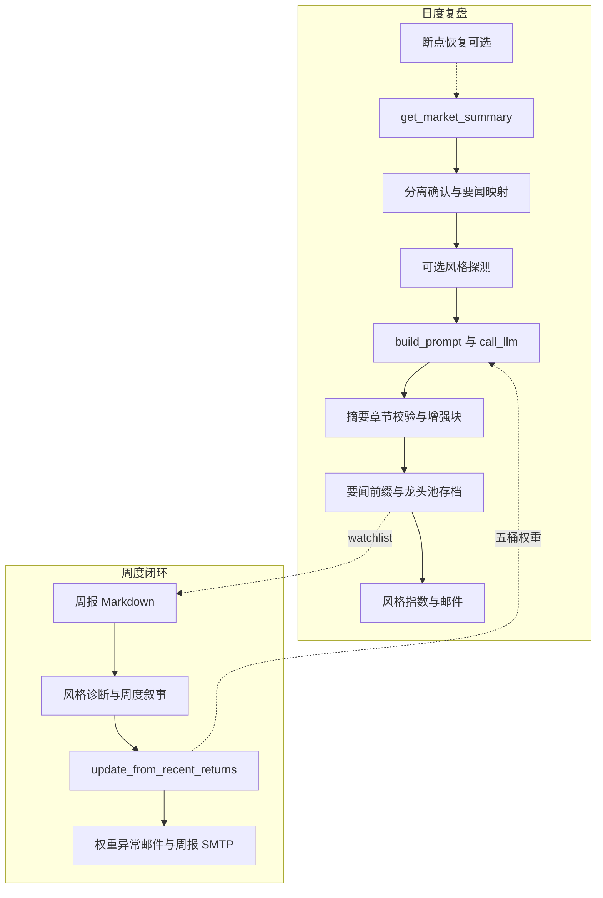

# 次日竞价半路 · A 股收盘复盘系统（完整说明）

本仓库是一套**命令行驱动的 A 股收盘复盘流水线**：程序侧通过 **akshare** 等拉取交易日历与行情，按「次日竞价半路」策略生成**主线、龙头池（top_pool）**、情绪阶段、篇首程序目录与市场摘要；再调用 **DeepSeek**（OpenAI 兼容 `chat/completions`）生成固定章节结构的 Markdown 长文，并可追加多段 **LLM 增强**；结果可 **SMTP 邮件**投递。系统**无 Web 前端**（`run.py` 仅提示已移除 Flask）。

> **声明**：输出仅供研究或自用记录，不构成投资建议。程序不对第三方数据源（如 akshare）的准确性、实时性作担保。  
> **维护**：实现细节以源码与 `tests/` 为准；架构级约定另见根目录 **`ARCHITECTURE.md`**。

---

## 目录（README）

1. [核心理念与术语](#核心理念与术语)  
2. [技术栈](#技术栈)  
3. [业务全景](#业务全景)  
4. [日度复盘：`ReplayTask` 逐步](#日度复盘replaytask-逐步)  
5. [数据与策略：`DataFetcher` 与关联模块](#数据与策略datafetcher-与关联模块)  
6. [篇首目录：`replay_catalog`](#篇首目录replay_catalog)  
7. [分离确认、要闻映射、Prompt](#分离确认要闻映射prompt)  
8. [大模型客户端与限流](#大模型客户端与限流)  
9. [复盘增强与周报叙事](#复盘增强与周报叙事)  
10. [邮件、模板与推送块](#邮件模板与推送块)  
11. [持久化：档案、风格指数、断点](#持久化档案风格指数断点)  
12. [周度闭环与策略偏好](#周度闭环与策略偏好)  
13. [配置：`DEFAULT_CONFIG` 全量说明](#配置default_config-全量说明)  
14. [嵌套 `data_source` 与数据源环境变量](#嵌套-data_source-与数据源环境变量)  
15. [环境变量总表（LLM / SMTP / 策略 / 校验）](#环境变量总表llm--smtp--策略--校验)  
16. [数据文件、缓存与断点目录](#数据文件缓存与断点目录)  
17. [脚本一览](#脚本一览)  
18. [测试、CI、GitHub Actions](#测试cigithub-actions)  
19. [部署](#部署)  
20. [仓库顶层结构（补充）](#仓库顶层结构补充)  
21. [辅助文档与排错索引](#辅助文档与排错索引)

---

## 核心理念与术语

> **程序算清量，模型写得像。**

| 术语 | 含义 |
|------|------|
| **龙头池 / top_pool** | `auction_halfway_strategy` 按规则输出的程序观察列表，非投资建议。 |
| **信号日** | 复盘成功写入 `watchlist_records.json` 的 `signal_date`（一般为程序完成的交易日）。 |
| **五桶权重** | 打板、低吸、趋势、龙头、其他；存于 `strategy_preference.json`，经 `build_prompt_addon` 注入主复盘 Prompt。 |
| **自然周** | 周报以 ISO 周（年-周）与锚点交易日组织，细节以 `weekly_performance.py` 为准。 |
| **市场阶段** | `compute_short_term_market_phase` 等逻辑输出的阶段文案（如主升期、高位震荡期、退潮·冰点期、混沌·试错期），与建议仓位区间一并供模型对齐。 |
| **情绪量化评分** | `sentiment_scorer.calculate_sentiment_score` 基于溢价、连板高度、炸板率、涨跌比等的 0～10 辅助分（与阶段叙事并存）。 |

---

## 技术栈

| 类别 | 说明 |
|------|------|
| 语言 | Python 3（CI 3.11；本地建议 3.10+）。 |
| 行情/数据 | pandas、**akshare**；部分结果经 `disk_cache` / `price_cache` 缓存。 |
| 大模型 | HTTP `requests`；**tenacity** 传输层重试；业务层对 **HTTP 429** 指数退避。 |
| 邮件 | SMTP；**markdown** + **Jinja2**（`email_template`）生成 HTML。 |
| 配置 | `app/utils/config.py` 中 `DEFAULT_CONFIG` 与根目录 **`replay_config.json`** 浅合并。 |
| 质量 | **`pytest`**、`scripts/validate.py`、CI 中 **ruff**（部分路径）。 |

---

## 业务全景

系统存在两条可并行理解的主线：**日度复盘**（`ReplayTask` + `nightly_replay.py`）与 **周度闭环**（`weekly_performance_email.py` + `strategy_preference`）。

---

## 日度复盘：`ReplayTask` 逐步

实现类：`app/services/replay_task.py` 中 **`ReplayTask.run(date, api_key, data_fetcher, email_cfg)`**。类内另有 `build_prompt`、`call_llm`、`try_begin`/`snapshot`/`log` 等（`snapshot` 供轮询形态使用，当前无 Web 亦可用于调试）。

| 顺序 | 行为 |
|------|------|
| 1 | **`resume_replay_if_available`** 且 **`enable_replay_checkpoint`**：尝试 `load_market_data_cache` + `load_fetcher_bundle`，恢复 `_last_auction_meta`、`_last_dragon_trader_meta`、`_last_email_kpi`、`_last_news_push_prefix`、`_last_zt_pool` 等，**跳过** `get_market_summary`。 |
| 2 | 否则 **`data_fetcher.get_market_summary(date)`**，得到 `market_data` 字符串与 `actual_date`（可能自动纠正到最近交易日）。耗时记入日志。 |
| 3 | 若开启断点：**`save_fetcher_bundle`** 写入 `data/replay_status/{date}_market.txt` 与 `{date}_meta.json`（含 dragon/auction/email_kpi/news_prefix/**zt_pool_records**）。 |
| 4 | **分离确认**：若 `_last_zt_pool` 为空则从 **`get_zt_pool(actual_date)`** 补拉；调用 **`perform_separation_confirmation`**，结果写入 Prompt（说明/候选/备注）。 |
| 5 | **要闻映射**：若存在 `_last_finance_news`，调用 **`analyze_finance_news`**（传入 `top_pool`），拼接至 meta。 |
| 6 | **风格稳定性探测**（`enable_style_stability_probe`，默认关）：`probe_style_stability` → `effective_weights_from_stability`；随后 **`replay_llm_spacing_sec` 睡眠**，再构建 Prompt。 |
| 7 | **`build_prompt`**：含 `build_prompt_addon`（五桶）、`dragon_meta` JSON 块、分离块、要闻块、主模板 **`MAIN_REPLAY_PROMPT`**。 |
| 8 | **`call_llm`** → **`_ensure_summary_line`**（用 `_last_market_phase`）→ **`_ensure_dragon_report_sections`**；若返回体被识别为 API 失败载荷，附加说明而不误判为「缺章节」。 |
| 9 | **`enable_replay_llm_enhancements`**：`collect_program_facts_snapshot` + `run_replay_deepseek_enhancements`，**`replay_llm_enhancements_spacing_sec`** 间隔；`replay_llm_enhancements_max_tokens` 控制长度。 |
| 10 | **`_last_news_push_prefix`**：经 **`truncate_finance_news_push_prefix`**（`email_news_max_items`、`email_news_filter_prefix`）拼到正文**最前**。 |
| 11 | **`program_completed` 且 `top_pool`**：`append_daily_top_pool` → **`data/watchlist_records.json`**。 |
| 12 | **`enable_daily_style_indices_persist`**：`persist_daily_indices` → **`data/market_style_indices.json`**。 |
| 13 | **邮件**：`has_email_config` 时 **`send_report_email`**，主题含 **`_extract_summary_line`**；附带 `email_kpi`、`email_dragon_meta` 等 `extra_vars`。失败路径同样可发信。 |

---

## 数据与策略：`DataFetcher` 与关联模块

- **`app/services/data_fetcher.py`**：交易日历、指数与个股快照、涨跌停池、板块与资金流、财联社要闻、龙虎榜（目录用）、概念/行业资金快照、`get_market_summary` 组装**完整市场 Markdown**（含 **`replay_catalog`** 注入的篇首目录、情绪仪表盘、连板条形图等）。  
- **`app/services/auction_halfway_strategy.py`**：主线与 **`top_pool`** 核心逻辑；与 `meta.program_completed`、`abort_reason` 等配合。  
- **`app/services/sentiment_scorer.py`**：情绪周期量化评分（多因子加权），由 `data_fetcher` 在合适位置调用 **`calculate_sentiment_score`**。  
- **`app/services/technical_indicators.py`**、**`trend_momentum_strategy.py`**：技术面与动量相关计算（供策略/摘要使用，具体调用链见源码）。  
- **`app/services/price_cache.py`**、**`app/utils/disk_cache.py`**：价格与通用磁盘缓存。  
- **`config/data_source_config.py`**：AK 重试、磁盘缓存 TTL、涨跌停等 DataFrame **必需列**名约定；可被 **`AK_*` / `API_CACHE_TTL_SEC`** 等环境变量覆盖。  
- **`app/services/data_source_errors.py`**：数据源异常类型辅助。

---

## 篇首目录：`replay_catalog`

- **`app/services/replay_catalog.py`**：按业务约定拼装 **「【程序生成】复盘数据目录」**（**0 盘面总览** + **1～6** 复盘总结块：首封时段、涨停原因、特色数据、龙虎榜、情绪指数与龙头池档案/快照、两市五日涨幅等；数据源不足时仍保留小节标题与说明）。  
- 与 `DataFetcher` 内 `get_market_summary` 紧耦合；板块/概念资金流、监控池行数、五日榜 TOP N 等均受 **`replay_config.json`** 中 `enable_replay_*`、`replay_watchlist_*`、`replay_spot_5d_*` 控制。

---

## 分离确认、要闻映射、Prompt

| 模块 | 路径 | 作用 |
|------|------|------|
| 分离确认 | `app/services/separation_confirmation.py` | 基于涨停池与交易日历，分时异动与同梯队候选，输出 **`perform_separation_confirmation`** 结构体。 |
| 要闻映射 | `app/services/news_mapper.py` | **`analyze_finance_news`**：关键词与板块映射、与 **龙头池** 字面命中等，生成可嵌入 Prompt 的 Markdown 段。 |
| 主模板 | `config/replay_prompt_templates.py` | **`MAIN_REPLAY_PROMPT`**、`build_main_replay_prompt`：固定章节（一至九章结构等），与程序目录约定对齐。 |
| 策略附加 | `app/services/strategy_preference.py` | **`build_prompt_addon`**、**`load_strategy_preference`**、**`probe_style_stability`**、**`effective_weights_from_stability`**。 |

---

## 大模型客户端与限流

- **`app/services/llm_client.py`**：`ChatCompletionClient.chat_completion`；默认 URL 取自环境变量 **`DEEPSEEK_API_URL`**（默认 `https://api.deepseek.com/v1/chat/completions`）。  
- **传输层**：**`LLM_RETRY_ATTEMPTS`**（默认 3），对 `Timeout`/`ConnectionError` 固定间隔重试。  
- **HTTP 429**：**`LLM_RETRY_429`**（次数）、**`LLM_RETRY_429_WAIT_SEC`**（基准秒）、**`LLM_RETRY_429_WAIT_MAX_SEC`**（单次上限），指数退避并尊重 **`Retry-After`**。  
- **超时**：环境变量 **`LLM_TIMEOUT_SEC`** 或 `replay_config.json` → **`data_source.llm_connect_timeout` / `llm_read_timeout`**。  
- **模型名**：`llm_model_name` 或 `deepseek_model_name`，缺省 **`deepseek-chat`**。  
- **Base URL**：`llm_api_base` 非空则覆盖默认 DeepSeek 地址。  
- **`get_llm_client(api_key)`**：Key 优先参数，否则 `ConfigManager` 中 `deepseek_api_key` / `llm_api_key`。

---

## 复盘增强与周报叙事

- **`app/services/replay_llm_enhancements.py`**：  
  - 复盘：**`run_replay_deepseek_enhancements`**（一致性、多空、龙头观察、待验证点等）；**`collect_program_facts_snapshot`** 汇总程序事实。  
  - 周报：**`run_weekly_trend_narrative`**（周度节奏与变化叙事）；与 **`enable_weekly_llm_trend_narrative`** 联动。  
- 周报中的「风格诊断」脚本内嵌于 **`scripts/weekly_performance_email.py`**（函数 **`_call_llm_weekly_style`**），不是 `replay_llm_enhancements` 主文件。

---

## 邮件、模板与推送块

- **`app/services/email_notify.py`**：**`resolve_email_config`**（环境变量优先于配置文件）、**`has_email_config`**、**`send_report_email`**、**`send_simple_email`**。  
- **`app/utils/email_template.py`**：**`markdown_to_email_html`**、**`truncate_finance_news_push_prefix`**、**`embed_image_cid`**（周报内嵌 `weights_trend.png`）等。  
- 配置项：**`email_html_template_enabled`**、**`email_content_prefix`**、**`email_news_max_items`**、**`email_news_filter_prefix`**、**`email_app_version`**、**`weekly_email_attach_charts`**。

---

## 持久化：档案、风格指数、断点

| 能力 | 说明 |
|------|------|
| **龙头池档案** | `app/services/watchlist_store.py`：**`append_daily_top_pool`** → `data/watchlist_records.json`。 |
| **风格指数** | `app/services/market_style_indices.py`：**`persist_daily_indices`** → `data/market_style_indices.json`（打板/趋势/低吸等）。 |
| **断点** | `app/services/replay_checkpoint.py`：`save_fetcher_bundle` / `load_*`；目录 **`data/replay_status/`**，文件 **`{YYYYMMDD}_market.txt`**、**`{YYYYMMDD}_meta.json`**。 |

---

## 周度闭环与策略偏好

1. **`scripts/weekly_performance_email.py`** 解析 **`--anchor`**（默认「北京时间今日之前最近交易日」）、**`--dry-run`**、**`--plot`**。  
2. **`build_weekly_report_markdown_auto`**（`weekly_performance.py`）：区间收益、标签归因、市场快照（`weekly_market_snapshot`）、严格涨幅前 20（受 `enable_strict_weekly_top20` 与 `weekly_strict_top20_max_universe` 限制）、自然月段落等。  
3. **`enable_weekly_ai_insight`**：追加 **风格诊断**（DeepSeek）。  
4. **`enable_weekly_llm_trend_narrative`**：追加 **周度节奏叙事**。  
5. 若存在 **`watchlist_records`** 且 **`enable_strategy_feedback_loop`**：**`update_from_recent_returns`** 更新 **`data/strategy_preference.json`** 与 **`strategy_evolution_log.jsonl`**；**`weight_alerts`** 非空且 **`enable_weekly_weight_anomaly_email`** 时另发提醒邮件。  
6. **`enable_weekly_performance_email`**：SMTP 发送周报；**`weekly_email_attach_charts`** 为真时尝试生成并内嵌 **`weights_trend.png`**（项目根）。  

- **`app/services/strategy_preference.py`**：五桶归一化、多周衰减、平滑、单桶上下限、**`strategy_max_weight_delta_per_update`**（与 `config/strategy_preference_config.py` 及环境变量 **`STRATEGY_*`** 协同）。  
- **`config/strategy_preference_config.py`**：**`WEIGHT_CLIP_*`**、**`MAX_WEIGHT_DELTA_PER_UPDATE`**、**`WEIGHT_HISTORY_MAX`**、多周衰减默认值等。

---

## 配置：`DEFAULT_CONFIG` 全量说明

以下键均可在 **`replay_config.json`** 中覆盖（**浅合并**，嵌套对象整体替换需注意）。默认值以 **`app/utils/config.py`** 为准。

### 大模型

| 键 | 含义 |
|----|------|
| `deepseek_api_key` / `llm_api_key` | API Key（二选一逻辑见 `get_llm_client`）。 |
| `llm_model_name` / `deepseek_model_name` | 模型名，默认空则 `deepseek-chat`。 |
| `llm_api_base` | 非空则覆盖默认 DeepSeek API URL。 |

### SMTP 与邮件呈现

| 键 | 含义 |
|----|------|
| `smtp_host` / `smtp_port` / `smtp_user` / `smtp_password` / `smtp_from` / `mail_to` | SMTP；`mail_to` 可多地址英文逗号。 |
| `smtp_ssl` | `True` 时 SMTPS（如 465）。 |
| `email_html_template_enabled` | 是否使用统一 HTML 模板。 |
| `email_content_prefix` | 长文邮件是否带标题区/摘要高亮/说明前缀。 |
| `email_news_max_items` | 邮件顶部要闻块最多条数。 |
| `email_news_filter_prefix` | 要闻摘要剔除的前缀（字面替换）。 |
| `email_app_version` | 邮件展示版本号。 |
| `weekly_email_attach_charts` | 周报是否尝试附 `weights_trend.png`。 |
| `cache_expire` | 通用缓存过期（秒）。 |
| `retry_times` | DataFetcher 等网络重试（语义见代码）。 |

### 技术面与旧版策略权重初值

| 键 | 含义 |
|----|------|
| `w_main` / `w_dragon` / `w_kline` / `w_liq` / `w_tech` | 五维初值（须约等于 1）。 |
| `tech_eval_topn` | 技术面精算队列长度（3～48）。 |
| `enable_tech_momentum` | 是否启用技术动量相关分支。 |

### 数据源与可选块（日度）

| 键 | 含义 |
|----|------|
| `enable_finance_news` | 财联社等要闻。 |
| `enable_individual_fund_flow_rank` / `individual_fund_flow_top_n` | 东财个股主力净流入排名。 |
| `enable_concept_cons_snapshot` / `concept_board_symbols` | 概念板块成分快照；符号名为空列表则跳过。 |
| `enable_intraday_tick_probe` / `intraday_tick_probe_symbol` | 腾讯分笔调试（默认关）。 |

### 周报与策略反馈

| 键 | 含义 |
|----|------|
| `enable_weekly_performance_email` | 是否发送周报邮件。 |
| `enable_weekly_ai_insight` | 周报是否调用大模型风格诊断。 |
| `enable_weekly_market_snapshot` | 周报是否含本周市场快照。 |
| `enable_daily_style_indices_persist` | 日终是否写入 `market_style_indices.json`。 |
| `enable_strict_weekly_top20` / `weekly_strict_top20_max_universe` | 自然周严格涨幅前 20（抽样上限）。 |
| `enable_strategy_feedback_loop` | 周末是否 `update_from_recent_returns`。 |
| `strategy_weight_smoothing` / `strategy_weight_max_single` / `strategy_weight_min_each` | 平滑与单桶上下限。 |
| `min_trades_per_style_for_weight` | 单周每桶最少样本数门槛。 |
| `use_multi_week_decay_for_strategy` / `multi_week_lookback` / `strategy_week_decay_factor` | 多周衰减。 |
| `min_total_trades_per_bucket_multiweek` | 多周合计每桶最少样本。 |
| `strategy_max_change_per_week` / `strategy_shift_pullback` | 单周变动上限与回拉。 |
| `strategy_max_weight_delta_per_update` | 单次更新每桶相对上一版最大绝对变化。 |

### 复盘 LLM 行为

| 键 | 含义 |
|----|------|
| `enable_style_stability_probe` | 主文前风格探测（多一次 API）。 |
| `replay_llm_spacing_sec` | 探测后与主文之间的等待秒数。 |
| `enable_replay_llm_enhancements` | 主文后增强块。 |
| `replay_llm_enhancements_max_tokens` | 增强块 max_tokens。 |
| `replay_llm_enhancements_spacing_sec` | 主文与增强块间隔秒数。 |
| `enable_weekly_llm_trend_narrative` | 周报周度叙事。 |
| `enable_weekly_weight_anomaly_email` | 权重异常单独发信。 |

### 复盘目录与监控池

| 键 | 含义 |
|----|------|
| `enable_replay_lhb_catalog` | 目录是否含龙虎榜（东财）。 |
| `enable_replay_concept_fund_snapshot` | 概念资金流 TOP。 |
| `enable_replay_watchlist_snapshot` / `replay_watchlist_max_rows` | 程序龙头池档案表。 |
| `replay_watchlist_monitor_span` | 监控窗口交易日数。 |
| `enable_replay_watchlist_spot_followup` / `replay_watchlist_spot_followup_max_codes` | 池内 5 日/今日快照。 |
| `enable_replay_spot_5d_leaderboard` / `replay_spot_5d_top_n` | 全 A 五日涨幅榜。 |

### 断点

| 键 | 含义 |
|----|------|
| `enable_replay_checkpoint` | 是否写入断点缓存。 |
| `resume_replay_if_available` | 是否优先从断点恢复并跳过 `get_market_summary`。 |

---

## 嵌套 `data_source` 与数据源环境变量

`DEFAULT_CONFIG["data_source"]` 默认包含：

| 键 | 含义 |
|----|------|
| `timeout` | 通用请求超时（秒）。 |
| `retry_times` | 重试次数。 |
| `cache_expire_days` | 缓存过期（天）。 |
| `cache_dir` | 缓存目录名（如 `data_cache`）。 |
| `llm_connect_timeout` / `llm_read_timeout` | 大模型连接/读取超时。 |

**`config/data_source_config.py`** 另载明 **`AK_RETRY_ATTEMPTS`**、**`AK_RETRY_WAIT_*`**、**`AK_FETCH_EXTRA_RETRIES`**、**`API_DISK_CACHE_TTL_SEC`** 等（与 akshare 拉取及磁盘缓存配合）。

---

## 环境变量总表（LLM / SMTP / 策略 / 校验）

| 变量 | 用途 |
|------|------|
| `DEEPSEEK_API_KEY` | DeepSeek API Key（推荐）。 |
| `DEEPSEEK_API_URL` | 覆盖默认 chat completions URL。 |
| `LLM_TIMEOUT_SEC` | 大模型单次请求超时。 |
| `LLM_RETRY_ATTEMPTS` | 传输层重试次数。 |
| `LLM_RETRY_429` / `LLM_RETRY_429_WAIT_SEC` / `LLM_RETRY_429_WAIT_MAX_SEC` | 429 业务重试与退避。 |
| `SMTP_HOST` / `SMTP_PORT` / `SMTP_USER` / `SMTP_PASSWORD` / `SMTP_FROM` / `MAIL_TO` / `SMTP_SSL` | SMTP（**`resolve_email_config` 优先环境变量**）。 |
| `AK_RETRY_ATTEMPTS` 等 | 见 `config/data_source_config.py`。 |
| `STRATEGY_WEIGHT_CLIP_LOW` / `STRATEGY_WEIGHT_CLIP_HIGH` / `STRATEGY_MAX_WEIGHT_DELTA` / `STRATEGY_WEIGHT_HISTORY_MAX` / `STRATEGY_WEEK_DECAY_FACTOR` / `STRATEGY_MULTI_WEEK_LOOKBACK` | 策略权重边界与历史长度（见 `strategy_preference_config.py`）。 |
| `VALIDATE_STRICT` | `validate.py` 对缺失文件是否更严格（`1`/`true`/`yes`）。 |
| `REPLAY_API_TOKEN` | 校验脚本探测用保留字段（当前无 Web API）。 |

---

## 数据文件、缓存与断点目录

| 路径 | 说明 |
|------|------|
| `replay_config.json` | 用户配置（建议敏感仓库不入库或仅环境变量）。 |
| `data/watchlist_records.json` | 龙头池周度统计输入。 |
| `data/strategy_preference.json` | 五桶权重。 |
| `data/strategy_evolution_log.jsonl` | 权重演进审计。 |
| `data/market_style_indices.json` | 风格指数。 |
| `data/replay_status/` | `{date}_market.txt`、`{date}_meta.json`。 |
| `data_cache/`（或配置目录） | 按日键磁盘缓存（TTL 见环境变量与 `data_source`）。 |
| `weights_trend.png` | 周报可选附件（项目根，由 `plot_evolution_log` 生成）。 |
| `data/backtest_results.png` | `scripts/backtest_weights.py --plot` 时生成。 |

---

## 脚本一览

| 脚本 | 说明 |
|------|------|
| **`scripts/nightly_replay.py`** | 夜间复盘：默认北京时间当日，非交易日退出 0；**`--date YYYYMMDD`** 指定交易日。Key：`DEEPSEEK_API_KEY` 或配置。 |
| **`scripts/weekly_performance_email.py`** | 周报：**`--anchor`**、**`--dry-run`**、**`--plot`**（`weights_trend.png`）。 |
| **`scripts/validate.py`** | 依赖导入、`strategy_preference` 权重和、`strategy_evolution_log.jsonl` 行 JSON、环境变量提示。 |
| **`scripts/health_check.py`** | 依赖与 ConfigManager、部分服务导入探测。 |
| **`scripts/backtest_weights.py`** | 离线网格搜索权重相关参数（**`--start`/`--end`/`--param-file`/`--plot`** 等，见脚本 docstring）。 |
| **`run.py`** | 仅打印 Web 已删除提示，退出码 2。 |

部署辅助：**`scripts/after_rsync.sh`**（创建 venv、`pip install -r requirements.txt`），由 **`deploy`** workflow 在远端执行。

---

## 测试、CI、GitHub Actions

### 测试文件（`tests/`）

| 文件 | 大致覆盖 |
|------|----------|
| `test_replay_catalog.py` | 目录与工具函数。 |
| `test_replay_enhancements.py` | 增强块。 |
| `test_replay_llm_failure.py` | LLM 失败载荷识别等。 |
| `test_replay_summary.py` | 摘要行。 |
| `test_finance_news.py` / `test_news_mapper_pool.py` | 要闻与映射。 |
| `test_market_phase.py` | 市场阶段。 |
| `test_market_style_indices.py` | 风格指数。 |
| `test_strategy_preference.py` | 策略偏好。 |
| `test_weekly_performance.py` / `test_weekly_attribution.py` | 周报与归因。 |

### CI（`.github/workflows/ci.yml`）

- 触发：`push`/`pull_request` 至 `main` 或 `master`。  
- 步骤：`pip install` → 导入烟测 `ReplayTask` → **`pytest tests/ -q`** → **ruff**（指定文件列表）→ **`python scripts/validate.py`** → **`python scripts/health_check.py`**。

### 定时与手动任务

| Workflow | 说明 |
|----------|------|
| **`scheduled-nightly.yml`** | 北京时间约 **18:00**（UTC 10:00）cron；**`workflow_dispatch`** 可选输入 **`date`**；需 Secrets：`DEEPSEEK_API_KEY`，可选 SMTP。 |
| **`weekly-report.yml`** | 北京时间 **周日 10:00**（UTC 周日 02:00）；周报脚本；依赖仓库内或 Runner 上 **`watchlist_records`**。 |

### 部署（`.github/workflows/deploy.yml`）

- 仅 **`workflow_dispatch`**；**rsync** 到自有 Linux（排除 `.git`、`replay_config.json` 等），远端执行 **`scripts/after_rsync.sh`**，可选 **`DEPLOY_REMOTE_COMMAND`**。  
- 所需 Secrets：`DEPLOY_HOST`、`DEPLOY_USER`、`DEPLOY_SSH_KEY`、`DEPLOY_PATH`。

---

## 部署

- 服务器上在 **`DEPLOY_PATH`** 手动放置 **`replay_config.json`** 或仅用环境变量跑 **`nightly_replay.py`**。  
- 定时：GitHub **`scheduled-nightly`** 或本机 **cron** / Windows **任务计划程序**。  
- **托管 Runner 不持久化 `data/`**：周报的 **`watchlist_records.json`** 需在自托管环境积累或同步。

---

## 仓库顶层结构（补充）

| 路径 | 说明 |
|------|------|
| `app/` | 业务包：`services/`（复盘、数据、策略、邮件等）、`utils/`（`config`、`email_template`、`logger`、`disk_cache`）。 |
| `config/` | `replay_prompt_templates.py`、`data_source_config.py`、`strategy_preference_config.py` 及包初始化。 |
| `tests/` | `pytest` 用例。 |
| `.github/workflows/` | `ci.yml`、`scheduled-nightly.yml`、`weekly-report.yml`、`deploy.yml`。 |
| `docs/` | 如 `smtp_env.md`（SMTP 环境变量说明）。 |

---

## 辅助文档与排错索引

| 文档 | 内容 |
|------|------|
| **`ARCHITECTURE.md`** | 模块边界、数据契约、排错表、术语、路线图、附录环境变量节选。 |
| **`docs/smtp_env.md`** | 仅用环境变量配置 SMTP 的说明与 PowerShell 示例（若与当前脚本名不一致，以 **`email_notify.resolve_email_config`** 与 **`nightly_replay`** 为准）。 |

**常见情况**（详见 `ARCHITECTURE.md`）：复盘无龙头池 / `abort_reason`；周报无邮件；**429** 限流；**`VALIDATE_STRICT`**；报告首行【摘要】异常。

---

*行为以主分支源码与 `pytest` 为准；配置项增减请同步更新 `app/utils/config.py` 与本 README / `ARCHITECTURE.md`。*
