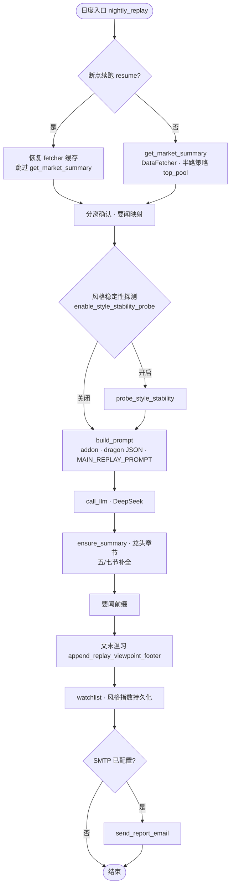

# PythonProject1 · A 股收盘智能复盘系统

> **命令行驱动的「数据 + 规则 + 大模型」流水线**：在交易日收盘后，自动聚合行情与题材数据，按「次日竞价半路」框架生成结构化复盘；程序负责**可验证的量化与目录**，语言模型负责**可读的长文叙述**，二者口径由同一套配置与模板锁定。

---

## 声明与边界

- **用途**：个人研究、记录与方法论演练；**不构成**投资建议，亦不构成任何证券买卖建议。
- **数据**：行情与板块等数据经 **akshare** 等渠道拉取；作者不对第三方源的完整性、实时性与准确性作担保，结论须自行交叉验证。
- **形态**：本仓库**不提供 Web 前端**。根目录 `run.py` 仅保留「前端已移除」的提示并以退出码 `2` 结束，请勿当作服务入口。
- **事实来源**：行为细节以**主分支源码**与 `tests/` 为准；模块契约与排错请阅 **`ARCHITECTURE.md`**，分层演进愿景见 **`docs/six_layer_architecture.md`**。

---

## 这套系统解决什么问题

短线复盘常见困境，是「数据散、口径乱、文字飘」：东一块西一块的涨停列表，与第二天交易计划之间缺少可复核的桥梁。本仓库将**单日复盘**固化为可重复执行的程序管线：先由 `DataFetcher` 等模块在统一缓存与重试策略下拉取日历、涨跌停池、板块与要闻等；再由 `auction_halfway_strategy` 产出**主线与龙头观察池（`top_pool`）**；随后把程序块、JSON 快照与固定章节 Prompt 一并交给 **DeepSeek**（OpenAI 兼容 `chat/completions`）生成 Markdown 长文；最后经摘要校验、缺章补全、要闻前缀与文末温习区定稿，并可经 **SMTP** 投递邮箱。

**设计上一句化**：程序算清量，模型写得像——KPI、表格与 Prompt、邮件展示**同一套数**，避免「正文与篇首目录各说各话」。

---

## 目录

1. [环境要求与快速开始](#环境要求与快速开始)  
2. [仓库地图](#仓库地图)  
3. [业务全景：日度与周度](#业务全景日度与周度)（[日度主路径图](#日度主路径示意图)）  
4. [日度复盘流水线（编排与步骤）](#日度复盘流水线编排与步骤)  
5. [术语与核心对象](#术语与核心对象)  
6. [技术栈与依赖](#技术栈与依赖)  
7. [数据获取、策略与 KPI](#数据获取策略与-kpi)  
8. [大模型客户端](#大模型客户端)  
9. [复盘增强包与 LLM 智能层（现状说明）](#复盘增强包与-llm-智能层现状说明)  
10. [邮件与 HTML 模板](#邮件与-html-模板)  
11. [文末温习与辅助脚本](#文末温习与辅助脚本)  
12. [持久化路径](#持久化路径)  
13. [周度闭环与策略偏好](#周度闭环与策略偏好)  
14. [配置：合并顺序与顶层键](#配置合并顺序与顶层键)  
15. [环境变量](#环境变量)  
16. [脚本索引](#脚本索引)  
17. [测试、CI 与 GitHub Actions](#测试ci-与-github-actions)  
18. [部署与运维注意](#部署与运维注意)  
19. [延伸阅读](#延伸阅读)  
20. [维护约定](#维护约定)  

---

## 环境要求与快速开始

**Python**：**3.10+**（持续集成使用 3.11）。

```bash
pip install -r requirements.txt
```

**最小可运行复盘**（需配置 `DEEPSEEK_API_KEY`，或在项目根 `replay_config.json` 中提供等价密钥）：

```bash
python scripts/nightly_replay.py
python scripts/nightly_replay.py --date 20260328
```

若未指定 `--date` 且当日**非交易日**，`nightly_replay.py` 会**跳过**复盘并以退出码 `0` 结束，适合挂接 cron 或 GitHub Actions 定时任务。

**配置文件**：默认读取项目根目录 **`replay_config.json`**（可选）。可通过环境变量 **`REPLAY_CONFIG_FILE`** 指向其他路径。合并规则见下文 [配置：合并顺序与顶层键](#配置合并顺序与顶层键)。

**健康检查**：

```bash
python scripts/validate.py
python scripts/health_check.py
```

---

## 仓库地图

下表按**职责**划分，便于新人从入口摸到领域与基础设施。

| 路径 | 职责 |
|------|------|
| `app/services/` | 核心业务：**数据拉取**（`data_fetcher`）、**复盘任务**（`replay_task`）、**半路策略**（`auction_halfway_strategy`）、篇首目录（`replay_catalog`）、报告补全（`report_builder`）、KPI、情绪、仓位、连板统计、邮件通知、LLM 客户端、周报与策略偏好等 |
| `app/adapters/` | 外系统适配：如 `email_smtp_adapter`、`llm_deepseek_adapter`、`market_summary_adapter` |
| `app/application/` | 用例与规则：`replay_text_rules`；**`llm_intel/`**（审计与结构化决策流水线） |
| `app/domain/` | `models`、`ports`（如 `LLMCompletionPort`、`EmailDeliveryPort`） |
| `app/orchestration/` | `replay_pipeline.py`：阶段名 `REPLAY_PIPELINE_PHASES` 与 `ReplayTask.run` 对齐 |
| `app/output/` | 输出侧组装，如 `replay_email_subject`（邮件主题） |
| `app/infrastructure/` | `config_defaults`、`unified_config`、`validation`、**`resilience/`**（熔断、`safe_execute`）、**`observability/`**（日志、事件、告警） |
| `app/utils/` | `config`、`logger`、`email_template`、`disk_cache`、`replay_viewpoint_footer`、`output_formatter` 等 |
| `config/` | `replay_prompt_templates.py`、`data_source_config.py`、`strategy_preference_config.py` 等 |
| `scripts/` | 可执行入口与辅助脚本 |
| `tests/` | `pytest` 用例 |
| `.github/workflows/` | `ci.yml`、`scheduled-nightly.yml`、`weekly-report.yml`、`weekly-theory-review.yml`、`deploy.yml` |
| `docs/` | 如 `smtp_env.md`、`six_layer_architecture.md` |

---

## 业务全景：日度与周度

**日度主线**（概念顺序）：拉取市场摘要 → 可选断点续跑 → 分离确认、要闻映射 → 可选风格稳定性探测 → 拼装 Prompt 并调用大模型 → 摘要与固定章节规则 → 可选五/七节补全 → 要闻前缀 → 文末温习 → 龙头池与风格指数持久化 → 可选 SMTP。

**周度主线**：`weekly_performance_email.py` 生成周报 Markdown → 可选 LLM 附录 → `update_from_recent_returns` 等反馈 → 权重异常告警（可配）→ 周报邮件。

**衔接关系**：日度产生的 **watchlist** 记录供周报统计；周末 **五桶权重** 经 `build_prompt_addon` 回注日度 Prompt，形成闭环。

### 日度主路径示意图

下图概括从数据摘要到成稿投递的主干顺序，与 **`ReplayTask.run`**（`app/services/replay_task.py`）一致；带「可选」的分支依赖配置开关或断点是否命中。GitHub / Gitee 预览原生支持 Mermaid。



可选生成**静态 PNG**业务示意图（邮件正文不依赖该图）：

```bash
python scripts/generate_readme_business_overview_chart.py
```

输出示例路径：`assets/readme_business_overview.png`。

---

## 日度复盘流水线（编排与步骤）

编排阶段定义见 **`app/orchestration/replay_pipeline.py`**（`REPLAY_PIPELINE_PHASES`），与 **`ReplayTask.run`**（`app/services/replay_task.py`）主路径一致。下表按**执行顺序**列出关键行为，便于对照日志与断点文件。

| 顺序 | 行为 |
|------|------|
| 1 | 若开启断点且 **`resume_replay_if_available`**：尝试恢复，**跳过** `get_market_summary` |
| 2 | 否则执行 **`data_fetcher.get_market_summary(date)`**，得到 `market_data` 与 `actual_date` |
| 3 | 断点开启时保存 **`save_fetcher_bundle`** → `data/replay_status/{date}_market.txt`、`_meta.json` |
| 4 | **分离确认**：必要时补拉涨停池，**`perform_separation_confirmation`** |
| 5 | **要闻映射**：**`analyze_finance_news`**（携带 `top_pool`） |
| 6 | **风格稳定性探测**（`enable_style_stability_probe`，默认关闭）：**`probe_style_stability`** → **`effective_weights_from_stability`**；可按 **`replay_llm_spacing_sec`** 间隔后再调主文 |
| 7 | **`build_prompt`**：含 `build_prompt_addon`、dragon JSON、分离块、要闻块、**`MAIN_REPLAY_PROMPT`** |
| 8 | **`call_llm`** → **`ensure_summary_line`** → **`append_core_stocks_and_plan_if_missing`** → **`ensure_dragon_report_sections`** |
| 9 | 截断并前置 **`_last_news_push_prefix`** |
| 10 | **`append_replay_viewpoint_footer`**（表格式五人理论 + 附录） |
| 11 | 若 **`program_completed`** 且存在 **top_pool**：**`append_daily_top_pool`** |
| 12 | 若 **`enable_daily_style_indices_persist`**：**`persist_daily_indices`** |
| 13 | **`send_report_email`**（若已配置 SMTP） |

**依赖注入**：**`ReplayTask`** 可传入 **`llm_port`**、**`email_port`**（见 `app/domain/ports.py`），便于单测或替换实现。

---

## 术语与核心对象

| 术语 | 说明 |
|------|------|
| **龙头池 / top_pool** | `auction_halfway_strategy` 按规则输出的程序观察列表，**非**投资建议 |
| **信号日** | 复盘成功且 `program_completed` 时写入 `watchlist_records.json` 的交易日 |
| **五桶权重** | 打板、低吸、趋势、龙头、其他；存于 `strategy_preference.json`，经 `build_prompt_addon` 注入主 Prompt |
| **自然周** | 周报以 ISO 周与锚点交易日组织（`weekly_performance.py`） |
| **市场阶段** | `compute_short_term_market_phase` 四象限文案；须与正文摘要及相应章节对齐 |
| **建议仓位（程序）** | `position_sizer.calc_position` 给出的区间描述，非固定百分比指令 |
| **情绪量化评分** | `sentiment_scorer.calculate_sentiment_score`（0～10），辅助刻度 |
| **大面** | 昨日涨停、今日跌幅**低于 -5%**或计入跌停池的家数；与 KPI 及正文口径一致 |

---

## 技术栈与依赖

| 类别 | 说明 |
|------|------|
| 语言 | Python 3.10+（CI 使用 3.11） |
| 数据 | **pandas**、**akshare**；`get_market_summary` 可在 **`market_summary_parallel_fetch`** 为真时以 **ThreadPoolExecutor** 并行拉取 |
| 缓存 | `disk_cache`（默认 `data/api_cache/`）、`price_cache`；可选启动时按 mtime 清扫（`disk_cache_sweep_ttl_sec`） |
| 大模型 | **requests**；**tenacity** 传输重试；HTTP **429** 在业务层指数退避 |
| 邮件 | SMTP；**markdown** + **Jinja2**（`email_template`） |
| 配置 | `app/infrastructure/config_defaults.py` 中的 **`DEFAULT_CONFIG`** → **`app/infrastructure/unified_config.py`** 与 **`app/utils/config.py`** |
| 质量 | **pytest**、`scripts/validate.py`；CI 额外 **ruff** 对部分路径静态检查 |

**`requirements.txt` 主要包**：`akshare`、`pandas`、`requests`、`markdown`、`pygments`、`jinja2`、`beautifulsoup4`、`pytest`、`matplotlib`、`tenacity`（以文件为准）。

---

## 数据获取、策略与 KPI

- **`DataFetcher`**（`app/services/data_fetcher.py`）  
  封装交易日历、指数与个股快照、涨跌停池、板块与资金流、财联社要闻（经 `news_fetcher`）、龙虎榜、概念/行业资金等。  
  **`get_market_summary`** 串联篇首目录、溢价、大面、晋级率、情绪推演、龙头快照、半路选股块等，形成注入主 Prompt 的 **`market_data`**。  
  涨停池等接口对东财字段有**修复与归一**（含 `lb` 连板数），并对磁盘/内存中旧格式缓存做列名兼容，避免「连板梯队」等块因缺列而整表归零。

- **`auction_halfway_strategy`**  
  产出主线与 **`top_pool`**；与 `meta.program_completed`、`abort_reason` 等字段配合，用于判断是否写入 watchlist、是否追加章节等。

- **`sentiment_scorer`**、**`technical_indicators`**、**`trend_momentum_strategy`**  
  情绪打分与技术面/动量；具体调用链以源码为准。

- **`config/data_source_config.py`**  
  AK 重试、磁盘缓存 TTL、DataFrame 列约定；环境变量覆盖见该文件及 **`ENV_FLAT_BINDINGS`**。

- **`data_source_errors`**  
  数据源异常类型（熔断、耗尽等），便于上层统一处理。

- **并行**  
  `market_summary_parallel_fetch` 为真时多路基础拉取并行；**`fetch_parallel_max_workers`** 在代码中有上下限钳制，避免过载。

**能力速查（按主题找模块）**

| 能力 | 模块 |
|------|------|
| 昨日涨停溢价分档 | `market_kpi.premium_analysis` |
| 大面 / 亏钱效应 | `DataFetcher.compute_big_face_count`、`market_kpi.big_loss_metrics` |
| 要闻过滤 | `news_fetcher` 相关性打分、`filter_news` |
| 连板梯队文本条 | `output_formatter.draw_text_bar` |
| 建议仓位 | `position_sizer.calc_position` |
| 明日情绪推演 | `cycle_analyzer.sentiment_forecast` |
| 连板晋级率表 | `ladder_stats.compute_promotion_rates_md` |
| 五/七节补全 | `report_builder.append_core_stocks_and_plan_if_missing` |
| 主 Prompt | `config/replay_prompt_templates.py`；别名 re-export：`llm_section_generator` |
| 篇首目录 | `replay_catalog` |
| 分离确认 / 要闻映射 | `separation_confirmation`、`news_mapper` |
| 策略权重附加 | `strategy_preference.build_prompt_addon` 等 |

---

## 大模型客户端

- **实现**：`app/services/llm_client.py` 中的 **`ChatCompletionClient`**。  
  默认 URL 来自 **`llm_default_url`**，或环境变量 **`DEEPSEEK_API_URL`** 的映射逻辑。

- **超时**：**`get_llm_client`** 使用 **`data_source.llm_connect_timeout`** / **`llm_read_timeout`**（连接与读响应拆分）。  
  环境变量 **`LLM_TIMEOUT_SEC`** 写入顶层 **`llm_transport_timeout_sec`**；**`ChatCompletionClient`** 是否读取该字段，**以当前源码为准**（README 不替代代码）。

- **重试**：**`llm_retry_attempts`**（`LLM_RETRY_ATTEMPTS`）。

- **429**：**`llm_retry_429`**、**`llm_retry_429_wait_sec`**、**`llm_retry_429_wait_max_sec`**；指数退避并尊重 **`Retry-After`**。

- **模型名**：**`llm_model_name`** / **`deepseek_model_name`**，缺省 **`deepseek-chat`**。

- **请求间隔**：**`resilience.llm_min_interval_sec`**（大于 0 时在 `llm_client` 侧节流）。

- **`get_llm_client(api_key)`**：参数优先，否则从配置读取 **`deepseek_api_key`** / **`llm_api_key`**。

---

## 复盘增强包与 LLM 智能层（现状说明）

以下组件**在代码库中存在且可测**，但与**默认日度主路径**的接法不同，请避免混淆。

| 组件 | 路径 | 与主流程关系 |
|------|------|----------------|
| **复盘增强四段** | `app/services/replay_llm_enhancements.py`（如 **`run_replay_enhancement_bundle`**） | **`ReplayTask` 日度主路径默认不调用**。周报等场景仍可能使用其中部分函数；配置项 **`enable_replay_llm_*`** 等保留给实验脚本或未来接回。 |
| **LLM 智能层** | `app/application/llm_intel/`（**`run_replay_intel_layer`**、确定性审计、结构化决策 LLM、**`render_intel_block`**） | 默认配置中 **`llm_intel.enabled`** 可为真，但 **`ReplayTask` 未接入**；可通过测试或自研脚本调用。见 **`tests/test_llm_intel.py`**。 |

---

## 邮件与 HTML 模板

- **`email_notify`**：**`resolve_email_config`**、**`send_report_email`**、**`send_simple_email`**（环境变量优先于文件配置）。

- **`email_template`**：Markdown 转 HTML、KPI 卡片、要闻截断、周报内嵌图、连板梯队历史表等。

- **常用键**：**`report_title_template`**（支持 `{trade_date}`）、**`email_system_name`**、**`email_news_max_items`**、**`email_news_filter_prefix`**、**`email_max_body_chars`** / **`email_max_subject_chars`**、**`weekly_email_attach_charts`** 等。

---

## 文末温习与辅助脚本

定稿阶段由 **`append_replay_viewpoint_footer`**（`replay_viewpoint_footer.py`）追加：**表格式**五人框架 + **`replay_footer_commentary`** 附录；**`replay_footer_inline_images()`** 对邮件正文恒为无内嵌 CID 图。

| 脚本 | 用途 |
|------|------|
| `weekly_theory_review_email.py` | 周六单独发送温习邮件 |
| `send_flowchart_preview_email.py` | 表格式预览邮件 |
| `generate_replay_footer_charts_extended.py` 等 | 本地生成 PNG 示意图（与邮件正文脱钩） |
| `register_weekly_theory_review_task.ps1` | Windows 计划任务注册 |

---

## 持久化路径

配置 **`paths`**（`config_defaults`）约定相对路径，由 **`ConfigManager.path(...)`** 解析为绝对路径：

| 逻辑文件 | 默认相对路径 |
|----------|----------------|
| 龙头池档案 | `data/watchlist_records.json` |
| 风格指数 | `data/market_style_indices.json` |
| 五桶权重 | `data/strategy_preference.json` |
| 权重演进日志 | `data/strategy_evolution_log.jsonl` |
| 断点 | `data/replay_status/` |
| 可观测性日志 | `data/logs/`（见 **`observability`**） |

磁盘 API 缓存默认 **`data/api_cache/`**；数据源侧缓存目录见 **`data_source.cache_dir`**（默认 `data_cache`）。

---

## 周度闭环与策略偏好

1. **`scripts/weekly_performance_email.py`**：支持 `--anchor`、`--dry-run`、`--plot`（如 `weights_trend.png`）。
2. **`weekly_performance.build_weekly_report_markdown_auto`**：收益、归因、市场快照、`weekly_market_snapshot`、严格涨幅前列等。
3. **`enable_weekly_ai_insight`**：风格诊断 LLM。
4. **`enable_weekly_llm_trend_narrative`**、**`enable_weekly_weight_llm_explanation`**：周度叙事与权重白话（各依赖对应开关）。
5. **`enable_strategy_feedback_loop`**：**`update_from_recent_returns`**；**`enable_weekly_weight_anomaly_email`** 为真时权重异常可另发邮件。
6. **`enable_weekly_performance_email`**：SMTP 发周报。

策略边界与衰减：**`strategy_preference.py`**、**`config/strategy_preference_config.py`**、环境变量 **`STRATEGY_*`**（见 **`ENV_FLAT_BINDINGS`**）。

---

## 配置：合并顺序与顶层键

**有效配置**构造（`build_effective_config`）顺序如下：

1. 代码内 **`DEFAULT_CONFIG`**  
2. **`replay_config.json`**（或 **`REPLAY_CONFIG_FILE`**）——与上一步**深度合并**  
3. **`strategy_profiles[active_strategy_profile]`**——再深度合并（profile 内嵌套键递归覆盖）  
4. 注入 **`paths.project_root`**  
5. 扁平环境变量（**`ENV_FLAT_BINDINGS`**，见 `unified_config.py`）  
6. 嵌套环境变量：前缀 **`REPLAY__`**，键路径用 **`__`** 分隔，例如 `REPLAY__data_source__timeout=12`

**顶层键（节选；完整以 `config_defaults.py` 为准）**

| 分组 | 键（示例） |
|------|------------|
| LLM | `deepseek_api_key`、`llm_api_key`、`llm_model_name`、`deepseek_model_name`、`llm_api_base`、`llm_default_url`、`llm_transport_timeout_sec`、`llm_retry_*`、`llm_chat_default_*` |
| 邮件 | `smtp_*`、`mail_to`、`email_*`、`report_title_template`、`email_system_name` |
| 性能 | `market_summary_parallel_fetch`、`fetch_parallel_max_workers`、`disk_cache_sweep_ttl_sec` |
| 复盘 / 断点 | `enable_replay_*`、`replay_watchlist_*`、`replay_spot_5d_*`、`enable_replay_checkpoint`、`resume_replay_if_available` |
| 周报 / 策略 | `enable_weekly_*`、`strategy_*`、`min_trades_*`、`multi_week_*` |
| 复盘 LLM 附加 | `enable_replay_llm_enhancements`、`replay_llm_enhancements_*`、`enable_replay_llm_chapter_qc` 等（主流程未必启用） |
| 文本规则 | `llm_failure_markers`、`llm_failure_payload_scan_chars`、`dragon_report_headings`、`replay_summary_line_max_chars`、`replay_text_templates` |
| 嵌套 | **`data_source`**、**`paths`**、**`resilience`**、**`observability`**、**`llm_intel`** 等 |

---

## 环境变量

| 变量 | 用途 |
|------|------|
| `DEEPSEEK_API_KEY` / `LLM_API_KEY` | API 密钥 |
| `DEEPSEEK_API_URL` | 映射到 `llm_default_url` |
| `LLM_API_BASE` | OpenAI 兼容 Base（与默认 URL 组合逻辑见 `get_llm_client`） |
| `LLM_TIMEOUT_SEC` | 写入 `llm_transport_timeout_sec`（详见上文「大模型客户端」） |
| `LLM_RETRY_ATTEMPTS`、`LLM_RETRY_429*` | 重试与 429 退避 |
| `SMTP_HOST`、`SMTP_PORT`、`SMTP_USER`、`SMTP_PASSWORD`、`SMTP_FROM`、`MAIL_TO` | SMTP（`resolve_email_config` 优先读环境变量） |
| `SMTP_SSL` | `email_notify` 直接读取（`true` / `1` 表示 SMTPS） |
| `REPLAY_CONFIG_FILE` | 自定义配置文件路径 |
| `STRATEGY_*` | 见 `ENV_FLAT_BINDINGS` 与 `strategy_preference_config.py` |
| `AK_*`、`API_*` 等 | 见 `config/data_source_config.py` |
| `VALIDATE_STRICT` | `validate.py` 严格模式 |
| `REPLAY__*` | 嵌套覆盖，见上文 |

---

## 脚本索引

| 脚本 | 说明 |
|------|------|
| `nightly_replay.py` | 日度复盘入口；`--date YYYYMMDD` |
| `weekly_performance_email.py` | 周报；`--anchor`、`--dry-run`、`--plot` |
| `weekly_theory_review_email.py` | 周六温习邮件 |
| `send_flowchart_preview_email.py` | 温习样式预览邮件 |
| `validate.py` | 依赖、权重和、演进日志 JSON 行、环境提示 |
| `health_check.py` | 配置与服务导入探测 |
| `backtest_weights.py` | 离线权重网格与绘图（见脚本 docstring） |
| `generate_readme_business_overview_chart.py` | 生成 README 业务全景 PNG |
| `generate_replay_footer_charts_extended.py` | 文末示意图 PNG（多风格） |
| `generate_replay_footer_kebi.py`、`generate_replay_footer_tuixue.py` | 单主题脚注图 |
| `generate_replay_viewpoint_footer.py`、`generate_replay_viewpoint_footer_asking.py` | 生成/调试 viewpoint 片段 |
| `register_weekly_theory_review_task.ps1` | Windows 计划任务 |
| `after_rsync.sh` | 部署后 venv 与 `pip install -r requirements.txt` |
| `run.py` | 提示 Web 已移除，退出码 2 |

---

## 测试、CI 与 GitHub Actions

### `tests/` 一览

| 文件 | 大致覆盖 |
|------|----------|
| `test_replay_catalog.py` | 篇首目录 |
| `test_replay_summary.py` | 摘要行 |
| `test_replay_llm_failure.py` | LLM 失败载荷识别 |
| `test_replay_enhancements.py` | 增强包拼接、并行顺序 |
| `test_report_builder.py` | 五/七节补全 |
| `test_finance_news.py`、`test_news_fetcher.py`、`test_news_mapper_pool.py` | 要闻与映射 |
| `test_market_kpi.py`、`test_market_phase.py`、`test_market_style_indices.py` | KPI、阶段、风格指数 |
| `test_output_formatter.py`、`test_ladder_utils.py` | 条形图、连板工具 |
| `test_strategy_engine.py`、`test_kebi_strategy.py` | 策略引擎相关 |
| `test_strategy_preference.py` | 五桶与 profile |
| `test_weekly_performance.py`、`test_weekly_attribution.py` | 周报与归因 |
| `test_resilience.py` | 熔断与安全执行 |
| `test_observability.py` | 可观测性 |
| `test_unified_config.py` | 配置合并与环境绑定 |
| `test_llm_intel.py` | LLM 智能层单元逻辑 |

### CI（`.github/workflows/ci.yml`）

在 `push` / `pull_request` 至 `main` 或 `master` 时：`pip install -r requirements.txt` → 导入烟测 `ReplayTask` → **`pytest tests/ -q`** → **ruff**（指定文件列表）→ **`validate.py`** → **`health_check.py`**。

### 定时与手动工作流

| Workflow | 说明 |
|----------|------|
| `scheduled-nightly.yml` | UTC `0 10 * * *`（约北京时间 **18:00**）；`workflow_dispatch` 可选输入 `date`；Secrets：`DEEPSEEK_API_KEY`，SMTP 可选 |
| `weekly-report.yml` | UTC `0 2 * * 0`（北京时间 **周日 10:00**）；依赖 `data/watchlist_records.json` |
| `weekly-theory-review.yml` | UTC `0 1 * * 6`（北京时间 **周六 09:00**）；温习邮件 |
| `deploy.yml` | 仅 `workflow_dispatch`；rsync + 远端 `after_rsync.sh`；Secrets：`DEPLOY_HOST`、`DEPLOY_USER`、`DEPLOY_SSH_KEY`、`DEPLOY_PATH` |

---

## 部署与运维注意

- 在 **`DEPLOY_PATH`** 放置 **`replay_config.json`** 或仅用环境变量完成密钥与 SMTP 配置。  
- 定时任务可选：GitHub **Nightly**、本机 cron 或 Windows 任务计划程序。  
- **GitHub 托管 Runner 不持久化 `data/`**：周报依赖的 **`watchlist_records.json`** 需在自托管 Runner 或自有同步策略下积累。  
- **常见故障**：无龙头池 / `abort_reason`；周报无邮件；**429**；**`VALIDATE_STRICT`**；摘要或章节异常——详见 **`ARCHITECTURE.md`**。

---

## 延伸阅读

| 文档 | 内容 |
|------|------|
| `ARCHITECTURE.md` | 模块边界、数据契约、排错、术语 |
| `docs/six_layer_architecture.md` | 六层架构目标与代码映射 |
| `docs/smtp_env.md` | 纯环境变量 SMTP 说明 |

---

## 维护约定

新增或变更行为时，请同步更新：

- **`app/infrastructure/config_defaults.py`**（若新增配置项）  
- 本 **README**  
- **`ARCHITECTURE.md`**（若涉及模块契约或排错）  
- **`docs/six_layer_architecture.md`**（若涉及分层边界）

**行为以主分支源码与 `pytest` 为准。**
