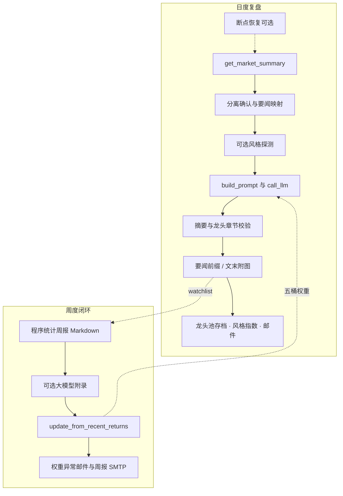
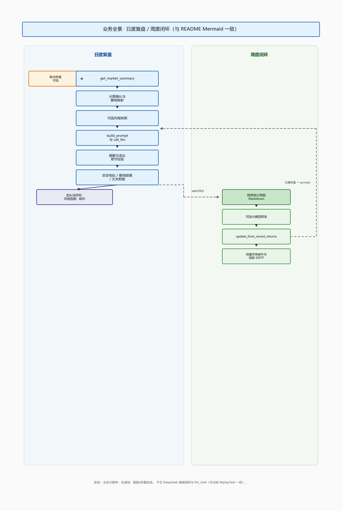

# T+0 竞价复盘 · A 股收盘智能简报（完整说明）

本仓库是一套**命令行驱动的 A 股收盘复盘流水线**：在**当日收盘后**拉取交易日历、涨跌停池、板块与资金流等，按「**次日竞价半路**」策略（见 `auction_halfway_strategy`）生成**主线、龙头池（`top_pool`）**、市场阶段与篇首程序目录；再调用 **DeepSeek**（OpenAI 兼容 `chat/completions`）按固定章节输出 Markdown 长文，必要时由**程序补全**「五 / 七」等章节；结果支持 **SMTP 邮件**投递。（日度主流程**不再**拼接「DeepSeek 增强四段」与「程序智能校验与决策摘要」；周报仍可按配置追加可选大模型段落。）页眉标题默认强调 **「对某一交易日的复盘」**（`report_title_template`），避免与「次日竞价」字面混淆。系统**无 Web 前端**（`run.py` 仅提示已移除 Flask）。

**你能得到什么**：一份「程序算清量、模型写得像」的复盘材料——上半部分是可核对的数据表与 KPI，下半部分是可读的周期叙事与预案；二者用同一套交易日与池子对齐，减少口径漂移。

**阅读建议**：先扫 **[程序侧量化与报告增强（能力清单）](#程序侧量化与报告增强能力清单)** 建立模块地图；再按 **[日度复盘：`ReplayTask` 逐步](#日度复盘replaytask-逐步)** 理解一次完整跑数；配置项以 **[配置：`DEFAULT_CONFIG` 全量说明](#配置default_config-全量说明)** 为索引。

> **声明**：输出仅供研究或自用记录，不构成投资建议。程序不对第三方数据源（如 akshare）的准确性、实时性作担保。  
> **维护**：实现细节以源码与 `tests/` 为准；模块边界与排错另见 **`ARCHITECTURE.md`**。

---

## 目录（README）

1. [核心理念与术语](#核心理念与术语)  
2. [技术栈](#技术栈)  
3. [业务全景](#业务全景)  
4. [程序侧量化与报告增强（能力清单）](#程序侧量化与报告增强能力清单)  
5. [日度复盘：`ReplayTask` 逐步](#日度复盘replaytask-逐步)  
6. [数据与策略：`DataFetcher` 与关联模块](#数据与策略datafetcher-与关联模块)  
7. [篇首目录：`replay_catalog`](#篇首目录replay_catalog)  
8. [分离确认、要闻映射、Prompt](#分离确认要闻映射prompt)  
9. [大模型客户端与限流](#大模型客户端与限流)  
10. [复盘增强与周报叙事](#复盘增强与周报叙事)  
11. [邮件、模板与推送块](#邮件模板与推送块)  
12. [复盘文末五人理论与每周温习](#复盘文末五人理论与每周温习)  
13. [持久化：档案、风格指数、断点](#持久化档案风格指数断点)  
14. [周度闭环与策略偏好](#周度闭环与策略偏好)  
15. [配置：`DEFAULT_CONFIG` 全量说明](#配置default_config-全量说明)（含 [性能与并发](#性能与并发)）  
16. [嵌套 `data_source` 与数据源环境变量](#嵌套-data_source-与数据源环境变量)  
17. [环境变量总表（LLM / SMTP / 策略 / 校验）](#环境变量总表llm--smtp--策略--校验)  
18. [数据文件、缓存与断点目录](#数据文件缓存与断点目录)  
19. [脚本一览](#脚本一览)  
20. [测试、CI、GitHub Actions](#测试cigithub-actions)  
21. [部署](#部署)  
22. [仓库顶层结构（补充）](#仓库顶层结构补充)  
23. [辅助文档与排错索引](#辅助文档与排错索引)

---

## 核心理念与术语

> **程序算清量，模型写得像。**

| 术语 | 含义 |
|------|------|
| **龙头池 / top_pool** | `auction_halfway_strategy` 按规则输出的程序观察列表，非投资建议。 |
| **信号日** | 复盘成功写入 `watchlist_records.json` 的 `signal_date`（一般为程序完成的交易日）。 |
| **五桶权重** | 打板、低吸、趋势、龙头、其他；存于 `strategy_preference.json`，经 `build_prompt_addon` 注入主复盘 Prompt。 |
| **自然周** | 周报以 ISO 周（年-周）与锚点交易日组织，细节以 `weekly_performance.py` 为准。 |
| **市场阶段** | `compute_short_term_market_phase` 输出的四象限文案（主升 / 高位震荡 / 退潮·冰点 / 混沌·试错）；与模型 **§1.2** 须对齐。 |
| **建议仓位（程序）** | `position_sizer.calc_position` 给出的**区间**（如 `20-35%`），由阶段 + 炸板率与涨停家数分位等共同决定；**非**固定百分比。 |
| **情绪量化评分** | `sentiment_scorer.calculate_sentiment_score`：溢价、连板高度、炸板率、涨跌比等加权 0～10 分，**辅助**刻度，不覆盖 §1.2 主轴。 |
| **大面（亏钱效应）** | 昨日涨停、今日 **跌幅低于 -5%** 或 **跌停** 计数；与龙头快照、邮件 KPI、§1.2 表一致。 |

---

## 技术栈

| 类别 | 说明 |
|------|------|
| 语言 | Python 3（CI 3.11；本地建议 3.10+）。 |
| 行情/数据 | pandas、**akshare**；`get_market_summary` 基础块可**线程池并行**（见 `market_summary_parallel_fetch`）；部分结果经 **`disk_cache`**（`data/api_cache/` JSON，TTL 到期读时删文件）与 `price_cache` 缓存。 |
| 大模型 | HTTP `requests`；**tenacity** 传输层重试；业务层对 **HTTP 429** 指数退避。 |
| 邮件 | SMTP；**markdown** + **Jinja2**（`email_template`）生成 HTML。 |
| 配置 | 默认键在 **`app/infrastructure/config_defaults.py`**（`DEFAULT_CONFIG`），经 **`app/utils/config.py`** 与根目录 **`replay_config.json`** 浅合并。 |
| 质量 | **`pytest`**、`scripts/validate.py`、CI 中 **ruff**（部分路径）。 |

---

## 业务全景

系统存在两条可并行理解的主线：**日度复盘**（`ReplayTask` + `nightly_replay.py`）与 **周度闭环**（`weekly_performance_email.py` + `strategy_preference`）。

生成：`python scripts/generate_readme_business_overview_chart.py`（依赖 matplotlib，输出 `assets/readme_business_overview.png`）。

---

## 程序侧量化与报告增强（能力清单）

以下能力均在 **`get_market_summary`** 或 **复盘任务** 中落地，写入 `market_data` 或邮件 `extra_vars`，供模型与读者**同一口径**引用。若某条依赖外网或缓存，失败时多降级为「—」或跳过，不阻断主流程。

| 能力 | 模块 / 入口 | 一句话说明 |
|------|----------------|------------|
| 昨日涨停溢价 | `app/services/market_kpi.py` → `premium_analysis` | 相对近 5 个交易日均值的偏离、历史分位与 **偏低 / 正常 / 偏高** 文案；非静态「正常」标签。 |
| 亏钱效应（大面） | `DataFetcher.compute_big_face_count`、`market_kpi.big_loss_metrics` | 昨日涨停股今日 **跌超 5%** 或 **跌停** 的家数；篇首 §1.2、邮件 KPI 与龙头快照一致。 |
| 要闻噪声过滤 | `app/services/news_fetcher.py` → `relevance_scoring`、`filter_news` | 宏观/关联摘要 **相关性 > 0.6**；龙头池命中项略抬分，避免误杀纯个股公告；宏观摘录 **最多 3 条**。 |
| 连板梯队条形图 | `app/utils/output_formatter.py` → `draw_text_bar` | `replay_catalog` 中 **「2连板: N ███░ (x.x%)」** 式文本条，占涨停池比例一目了然。 |
| 建议仓位（动态） | `app/services/position_sizer.py` → `calc_position` | 与 **市场阶段**、近窗 **涨停家数 / 炸板率分位**、绝对炸板率挂钩的区间字符串（非固定 30%）。 |
| 明日情绪推演 | `app/services/cycle_analyzer.py` → `sentiment_forecast` | 结合炸板率变化、溢价、跌停数的**定性**预判句，摘要中单列 **「程序·明日情绪推演」**。 |
| 连板晋级率 | `app/services/ladder_stats.py` → `compute_promotion_rates_md` | **1→2 / 2→3 / 3→4** 文本表（昨日涨停池与今日涨停池对齐）。 |
| 五 / 七节补全 | `app/services/report_builder.py` | 模型漏写 **「五、核心股聚焦」「七、明日预案」** 时按程序事实补块（可选 LLM 润色）。 |
| 主 Prompt 与别名 | `config/replay_prompt_templates.py`、`app/services/llm_section_generator.py` | 固定章节与 **总龙头须来自 `top_dragon`/涨停池** 等硬性约束；后者为模板 re-export，便于检索。 |
| 邮件标题与系统名 | `app/utils/config.py` | **`report_title_template`**（支持 `{trade_date}`）、**`email_system_name`**（如「T+0 竞价复盘系统」），与正文「当日复盘」语义一致。 |

**近 5 日连板历史表「最高」列**：由 `ladder_utils.display_max_lb_row` 等与 `compute_ladder_history_5d` 对齐，避免 `max_lb` 为 0/1 时与分档表矛盾（详见 `tests/test_ladder_utils.py`）。

---

## 日度复盘：`ReplayTask` 逐步

实现类：`app/services/replay_task.py` 中 **`ReplayTask.run(date, api_key, data_fetcher, email_cfg)`**。类内另有 `build_prompt`、`call_llm`、`try_begin`/`snapshot`/`log` 等（`snapshot` 供轮询形态使用，当前无 Web 亦可用于调试）。

| 顺序 | 行为 |
|------|------|
| 1 | **`resume_replay_if_available`** 且 **`enable_replay_checkpoint`**：尝试 `load_market_data_cache` + `load_fetcher_bundle`，恢复 `_last_auction_meta`、`_last_dragon_trader_meta`、`_last_email_kpi`、`_last_news_push_prefix`、`_last_zt_pool` 等，**跳过** `get_market_summary`。 |
| 2 | 否则 **`data_fetcher.get_market_summary(date)`**，得到 `market_data` 字符串与 `actual_date`（可能自动纠正到最近交易日）。耗时记入日志。 |
| 3 | 若开启断点：**`save_fetcher_bundle`** 写入 `data/replay_status/{date}_market.txt` 与 `{date}_meta.json`（含 dragon/auction/email_kpi/news_prefix/**zt_pool_records**）。 |
| 4 | **分离确认**：若 `_last_zt_pool` 为空则从 **`get_zt_pool(actual_date)`** 补拉；调用 **`perform_separation_confirmation`**，结果写入 Prompt（说明/候选/备注）。 |
| 5 | **要闻映射**：若存在 `_last_finance_news`，调用 **`analyze_finance_news`**（传入 `top_pool`），拼接至 meta。 |
| 6 | **风格稳定性探测**（`enable_style_stability_probe`，默认关）：`probe_style_stability` → `effective_weights_from_stability`；随后 **`replay_llm_spacing_sec` 睡眠**，再构建 Prompt。 |
| 7 | **`build_prompt`**：含 `build_prompt_addon`（五桶）、`dragon_meta` JSON 块、分离块、要闻块、主模板 **`MAIN_REPLAY_PROMPT`**。 |
| 8 | **`call_llm`** → **`_ensure_summary_line`**（用 `_last_market_phase`）→ **`append_core_stocks_and_plan_if_missing`**（可选）→ **`_ensure_dragon_report_sections`**；若返回体被识别为 API 失败载荷，附加说明而不误判为「缺章节」。 |
| 9 | **`_last_news_push_prefix`**：经 **`truncate_finance_news_push_prefix`**（`email_news_max_items`、`email_news_filter_prefix`）拼到正文**最前**（插在主长文与后续块之前）。 |
| 10 | **`program_completed` 且 `top_pool`**：`append_daily_top_pool` → **`data/watchlist_records.json`**。 |
| 11 | **`enable_daily_style_indices_persist`**：`persist_daily_indices` → **`data/market_style_indices.json`**。 |
| 12 | **`append_replay_viewpoint_footer`**：在要闻前缀拼入之后，为定稿追加 **「每日必看 吾日三省吾身」** 区块（五人 PNG + **`replay_footer_commentary`** 解读 + 附录；邮件 **`inline_images`** 见 `replay_footer_inline_images`）。 |
| 13 | **邮件**：`has_email_config` 时 **`send_report_email`**；`extra_vars` 含 **`report_banner_title`**（来自 `report_title_template`）、**`email_kpi`**（含大面、溢价文案、动态仓位等）、**`email_dragon_meta`**。失败路径同样可发信。 |

---

## 数据与策略：`DataFetcher` 与关联模块

- **`app/services/data_fetcher.py`**：交易日历、指数与个股快照、涨跌停池、板块与资金流、财联社要闻（经 **`news_fetcher`** 过滤）、龙虎榜（目录用）、概念/行业资金快照；**`get_market_summary`** 串联篇首目录、**溢价分析、大面计数、晋级率表、明日情绪推演**、龙头快照、半路选股与 AI 提示块，形成注入主 Prompt 的 **`market_data`**。  
- **`app/services/auction_halfway_strategy.py`**：主线与 **`top_pool`** 核心逻辑；与 `meta.program_completed`、`abort_reason` 等配合。  
- **`app/services/sentiment_scorer.py`**：情绪周期量化评分（多因子加权），由 `data_fetcher` 在合适位置调用 **`calculate_sentiment_score`**。  
- **`app/services/technical_indicators.py`**、**`trend_momentum_strategy.py`**：技术面与动量相关计算（供策略/摘要使用，具体调用链见源码）。  
- **`app/services/price_cache.py`**、**`app/utils/disk_cache.py`**：价格与通用磁盘 JSON 缓存（默认目录 **`data/api_cache/`**）；**`get_json`** 在 TTL 过期时**删除**过期文件；**`sweep_expired_json_files`** 可按目录批量清理。进程内**首次**构造 **`DataFetcher`** 时，若 **`disk_cache_sweep_ttl_sec` > 0**，会对上述目录做一次过期清扫（默认 86400 秒；设为 `0` 可关闭）。  
- **`get_market_summary`**：当 **`market_summary_parallel_fetch`** 为 `true`（默认）时，涨跌停池、板块、北向、溢价、涨跌家数等基础拉取在 **`ThreadPoolExecutor`** 中并发执行，线程数与 **`fetch_parallel_max_workers`**（默认 8，代码侧有上下限钳制）相关；为 `false` 时退回逐步串行拉取，**业务结果与合并顺序不变**。  
- **`config/data_source_config.py`**：AK 重试、磁盘缓存 TTL、涨跌停等 DataFrame **必需列**名约定；可被 **`AK_*` / `API_CACHE_TTL_SEC`** 等环境变量覆盖。  
- **`app/services/data_source_errors.py`**：数据源异常类型辅助。

---

## 篇首目录：`replay_catalog`

- **`app/services/replay_catalog.py`**：按业务约定拼装 **「【程序生成】复盘数据目录」**（**0 盘面总览** + **1～6** 复盘总结块：首封时段、涨停原因、特色数据、龙虎榜、情绪指数与龙头池档案/快照、两市五日涨幅等；数据源不足时仍保留小节标题与说明）。  
- **§1.1 连板梯队**：除文字结构外，使用 **`output_formatter.draw_text_bar`** 生成分档 **文本条形图**（占涨停池比例）。  
- **§1.2 市场数据概括**：表格中含 **昨日涨停溢价（带分档文案）**、**大面家数**、北向与情绪温度等（具体以当日数据为准）。  
- 与 `DataFetcher` 内 `get_market_summary` 紧耦合；板块/概念资金流、监控池行数、五日榜 TOP N 等均受 **`replay_config.json`** 中 `enable_replay_*`、`replay_watchlist_*`、`replay_spot_5d_*` 控制。

---

## 分离确认、要闻映射、Prompt

| 模块 | 路径 | 作用 |
|------|------|------|
| 分离确认 | `app/services/separation_confirmation.py` | 基于涨停池与交易日历，分时异动与同梯队候选，输出 **`perform_separation_confirmation`** 结构体。 |
| 要闻映射 | `app/services/news_mapper.py` | **`analyze_finance_news`**：关键词与板块映射、与 **龙头池** 字面命中等，生成可嵌入 Prompt 的 Markdown 段。 |
| 要闻抓取后过滤 | `app/services/news_fetcher.py` | 在 `get_finance_news_bundle` 内对关联/宏观列表做 **相关性打分** 与条数限制，压低 OCR/弱关联噪声。 |
| 主模板 | `config/replay_prompt_templates.py` | **`MAIN_REPLAY_PROMPT`**、`build_main_replay_prompt`：固定章节（一至九章）、**总龙头事实来源**、**明日情绪推演** 等与程序块对齐。 |
| 模板别名 | `app/services/llm_section_generator.py` | 对主模板 re-export，便于按「章节生成器」关键词检索。 |
| 策略附加 | `app/services/strategy_preference.py` | **`build_prompt_addon`**、**`load_strategy_preference`**、**`probe_style_stability`**、**`effective_weights_from_stability`**。 |

---

## 大模型客户端与限流

- **`app/services/llm_client.py`**：`ChatCompletionClient.chat_completion`；默认 URL 取自环境变量 **`DEEPSEEK_API_URL`**（默认 `https://api.deepseek.com/v1/chat/completions`）。  
- **传输层**：**`LLM_RETRY_ATTEMPTS`**（默认 3），对 `Timeout`/`ConnectionError` 固定间隔重试。  
- **HTTP 429**：**`LLM_RETRY_429`**（次数）、**`LLM_RETRY_429_WAIT_SEC`**（基准秒）、**`LLM_RETRY_429_WAIT_MAX_SEC`**（单次上限），指数退避并尊重 **`Retry-After`**。  
- **超时**：环境变量 **`LLM_TIMEOUT_SEC`** 或 `replay_config.json` → **`data_source.llm_connect_timeout` / `llm_read_timeout`**。  
- **模型名**：`llm_model_name` 或 `deepseek_model_name`，缺省 **`deepseek-chat`**。  
- **Base URL**：`llm_api_base` 非空则覆盖默认 DeepSeek 地址。  
- **`get_llm_client(api_key)`**：Key 优先参数，否则 `ConfigManager` 中 `deepseek_api_key` / `llm_api_key`。

---

## 复盘增强与周报叙事

- **`app/services/replay_llm_enhancements.py`**：仍提供 **`run_replay_enhancement_bundle`** 等函数，但 **`ReplayTask` 日度主流程已不再调用**（不再向复盘邮件拼接「DeepSeek 增强四段」）。周报侧仍使用 **`run_weekly_trend_narrative`**、**`run_weekly_weight_explanation`** 等，与对应 `enable_weekly_*` 开关联动。  
- 周报「风格诊断」在 **`scripts/weekly_performance_email.py`**（**`_call_llm_weekly_style`**），与 `enable_weekly_ai_insight` 联动。

---

## 邮件、模板与推送块

- **`app/services/email_notify.py`**：**`resolve_email_config`**（环境变量优先于配置文件）、**`has_email_config`**、**`send_report_email`**、**`send_simple_email`**。  
- **`app/utils/email_template.py`**：**`markdown_to_email_html`**、**`build_email_content_prefix`**（页眉标题、**MARKET KPI 卡**、连板历史模块、说明段）、**`truncate_finance_news_push_prefix`**、**`embed_image_cid`**（周报内嵌 `weights_trend.png`）等。  
- **KPI 卡**（`build_kpi_card_html`）：涨停/跌停、炸板率、昨日溢价（可含近 5 日对比句）、**大面家数**、**建议仓位区间**——与 `get_market_summary` 末尾写入的 **`_last_email_kpi`** 一致。  
- 配置项：**`email_html_template_enabled`**、**`email_content_prefix`**、**`email_news_max_items`**、**`email_news_filter_prefix`**、**`email_app_version`**、**`weekly_email_attach_charts`**；页眉主标题见 **`report_title_template`**（`{trade_date}`），页脚系统名见 **`email_system_name`**。

---

## 复盘文末五人理论与每周温习

日复盘主文在邮件发出前，会在末尾追加**固定附图区**（与正文由 `---` 分隔），用于温习短线名家框架；**每周六**还可单独再发一封**仅含该温习内容**的邮件，与当日复盘无关。

| 项目 | 说明 |
|------|------|
| **五人顺序** | **炒股养家** → **退学炒股** → **Asking（邱宝裕）** → **92科比** → **涅槃重升**。 |
| **附图文件** | 五张 PNG 放在 **`assets/`**（如 `replay_footer_yangjia.png`、`replay_footer_tuixue.png`、`replay_viewpoint_footer_asking.png`、`replay_footer_kebi.png`、`replay_footer_niepan.png`）。 |
| **邮件内嵌** | Markdown 使用 ``，**`send_report_email(..., inline_images=...)`** 按 CID 附加 MIME 图片（见 `replay_footer_inline_images()`）。 |
| **解读与附录** | **`app/utils/replay_footer_commentary.py`**：每张图下配 **Markdown 解读**，文末附 **四大框架 / 五维对照** 表。日复盘小节标题为 **「每日必看 吾日三省吾身」**。 |
| **拼接入口** | **`app/utils/replay_viewpoint_footer.py`**：`append_replay_viewpoint_footer(md)`；`ReplayTask` 在定稿后调用。 |
| **绘图脚本** | 通用流程图：**`app/utils/replay_footer_chart_draw.py`**（`save_flowchart_png`、`save_readme_business_overview_png`、`save_kebi_framework_png` 等）。README 业务全景：**`scripts/generate_readme_business_overview_chart.py`**。重绘示例：`scripts/generate_replay_footer_charts_extended.py`、`generate_replay_footer_kebi.py`、`generate_replay_footer_tuixue.py`、`generate_replay_viewpoint_footer_asking.py`（依赖 matplotlib）。 |
| **每周温习邮件** | **`scripts/weekly_theory_review_email.py`**：调用 **`build_theory_review_markdown()`** 生成独立正文（**六层架构图** `architecture_six_layers.png` + 五人理论）；主题形如 **`【温习】五人理论 + 六层架构 · YYYY-MM-DD`**，SMTP 与 **`replay_footer_inline_images_weekly()`**（含架构图 CID）。 |
| **GitHub 定时** | **`.github/workflows/weekly-theory-review.yml`**：`cron: "0 1 * * 6"` → **北京时间每周六 09:00**（与 `scheduled-nightly`、`weekly-report` 一样使用 `SMTP_*`、`MAIL_TO` 等 Secrets）。支持 **`workflow_dispatch`** 手动触发。 |
| **Windows 本机定时** | **`scripts/register_weekly_theory_review_task.ps1`**：注册计划任务 **每周六 09:00**（本地时区）执行上述 Python 脚本；需已配置 SMTP 且能访问项目目录。 |

---

## 持久化：档案、风格指数、断点

| 能力 | 说明 |
|------|------|
| **龙头池档案** | `app/services/watchlist_store.py`：**`append_daily_top_pool`** → `data/watchlist_records.json`。 |
| **风格指数** | `app/services/market_style_indices.py`：**`persist_daily_indices`** → `data/market_style_indices.json`（打板/趋势/低吸等）。 |
| **断点** | `app/services/replay_checkpoint.py`：`save_fetcher_bundle` / `load_*`；目录 **`data/replay_status/`**，文件 **`{YYYYMMDD}_market.txt`**、**`{YYYYMMDD}_meta.json`**。 |

---

## 周度闭环与策略偏好

1. **`scripts/weekly_performance_email.py`** 解析 **`--anchor`**（默认「北京时间今日之前最近交易日」）、**`--dry-run`**、**`--plot`**。  
2. **`build_weekly_report_markdown_auto`**（`weekly_performance.py`）：区间收益、标签归因、市场快照（`weekly_market_snapshot`）、严格涨幅前 20（受 `enable_strict_weekly_top20` 与 `weekly_strict_top20_max_universe` 限制）、自然月段落等。  
3. **`enable_weekly_ai_insight`**：追加 **风格诊断**（DeepSeek）。  
4. **`enable_weekly_llm_trend_narrative`**：追加 **周度节奏叙事**。  
5. 若存在 **`watchlist_records`** 且 **`enable_strategy_feedback_loop`**：**`update_from_recent_returns`** 更新 **`data/strategy_preference.json`** 与 **`strategy_evolution_log.jsonl`**；**`weight_alerts`** 非空且 **`enable_weekly_weight_anomaly_email`** 时另发提醒邮件。  
6. **`enable_weekly_performance_email`**：SMTP 发送周报；**`weekly_email_attach_charts`** 为真时尝试生成并内嵌 **`weights_trend.png`**（项目根）。  

- **`app/services/strategy_preference.py`**：五桶归一化、多周衰减、平滑、单桶上下限、**`strategy_max_weight_delta_per_update`**（与 `config/strategy_preference_config.py` 及环境变量 **`STRATEGY_*`** 协同）。  
- **`config/strategy_preference_config.py`**：**`WEIGHT_CLIP_*`**、**`MAX_WEIGHT_DELTA_PER_UPDATE`**、**`WEIGHT_HISTORY_MAX`**、多周衰减默认值等。

---

## 配置：`DEFAULT_CONFIG` 全量说明

以下键均可在 **`replay_config.json`** 中覆盖（**浅合并**，嵌套对象整体替换需注意）。默认值以 **`app/infrastructure/config_defaults.py`**（经 **`app/utils/config.py`** 加载）为准。

### 大模型

| 键 | 含义 |
|----|------|
| `deepseek_api_key` / `llm_api_key` | API Key（二选一逻辑见 `get_llm_client`）。 |
| `llm_model_name` / `deepseek_model_name` | 模型名，默认空则 `deepseek-chat`。 |
| `llm_api_base` | 非空则覆盖默认 DeepSeek API URL。 |

### SMTP 与邮件呈现

| 键 | 含义 |
|----|------|
| `smtp_host` / `smtp_port` / `smtp_user` / `smtp_password` / `smtp_from` / `mail_to` | SMTP；`mail_to` 可多地址英文逗号。 |
| `smtp_ssl` | `True` 时 SMTPS（如 465）。 |
| `email_html_template_enabled` | 是否使用统一 HTML 模板。 |
| `email_content_prefix` | 长文邮件是否带标题区/摘要高亮/说明前缀。 |
| `email_news_max_items` | 邮件顶部要闻块最多条数。 |
| `email_news_filter_prefix` | 要闻摘要剔除的前缀（字面替换）。 |
| `email_app_version` | 邮件展示版本号。 |
| `report_title_template` | 邮件/HTML 页眉主标题；支持占位符 **`{trade_date}`**（YYYYMMDD）。默认强调「对某日复盘」，与「次日竞价」策略名区分。 |
| `email_system_name` | 页脚与模板中的系统展示名（如 **T+0 竞价复盘系统**）。 |
| `weekly_email_attach_charts` | 周报是否尝试附 `weights_trend.png`。 |
| `cache_expire` | 通用缓存过期（秒）。 |
| `retry_times` | DataFetcher 等网络重试（语义见代码）。 |

### 技术面与旧版策略权重初值

| 键 | 含义 |
|----|------|
| `w_main` / `w_dragon` / `w_kline` / `w_liq` / `w_tech` | 五维初值（须约等于 1）。 |
| `tech_eval_topn` | 技术面精算队列长度（3～48）。 |
| `enable_tech_momentum` | 是否启用技术动量相关分支。 |

### 数据源与可选块（日度）

| 键 | 含义 |
|----|------|
| `enable_finance_news` | 财联社等要闻。 |
| `enable_individual_fund_flow_rank` / `individual_fund_flow_top_n` | 东财个股主力净流入排名。 |
| `enable_concept_cons_snapshot` / `concept_board_symbols` | 概念板块成分快照；符号名为空列表则跳过。 |
| `enable_intraday_tick_probe` / `intraday_tick_probe_symbol` | 腾讯分笔调试（默认关）。 |

### 周报与策略反馈

| 键 | 含义 |
|----|------|
| `enable_weekly_performance_email` | 是否发送周报邮件。 |
| `enable_weekly_ai_insight` | 周报是否调用大模型风格诊断。 |
| `enable_weekly_market_snapshot` | 周报是否含本周市场快照。 |
| `enable_daily_style_indices_persist` | 日终是否写入 `market_style_indices.json`。 |
| `enable_strict_weekly_top20` / `weekly_strict_top20_max_universe` | 自然周严格涨幅前 20（抽样上限）。 |
| `enable_strategy_feedback_loop` | 周末是否 `update_from_recent_returns`。 |
| `strategy_weight_smoothing` / `strategy_weight_max_single` / `strategy_weight_min_each` | 平滑与单桶上下限。 |
| `min_trades_per_style_for_weight` | 单周每桶最少样本数门槛。 |
| `use_multi_week_decay_for_strategy` / `multi_week_lookback` / `strategy_week_decay_factor` | 多周衰减。 |
| `min_total_trades_per_bucket_multiweek` | 多周合计每桶最少样本。 |
| `strategy_max_change_per_week` / `strategy_shift_pullback` | 单周变动上限与回拉。 |
| `strategy_max_weight_delta_per_update` | 单次更新每桶相对上一版最大绝对变化。 |

### 复盘 LLM 行为

以下含 **`enable_replay_llm_*`** 的键仍写入配置；**当前 `ReplayTask` 不会读取它们**（日度邮件不再拼接增强 bundle）。保留以便将来恢复或供本地实验脚本调用。

| 键 | 含义 |
|----|------|
| `enable_style_stability_probe` | 主文前风格探测（多一次 API）。 |
| `replay_llm_spacing_sec` | 探测后与主文之间的等待秒数。 |
| `enable_replay_llm_enhancements` | （当前未接入主流程）主文后增强块（一致性、多空、龙头观察等）。 |
| `replay_llm_enhancements_max_tokens` | 增强块 max_tokens（默认 6144）。 |
| `replay_llm_enhancements_spacing_sec` | 主文与增强块间隔秒数。 |
| `enable_replay_llm_chapter_qc` | 独立调用：周期定性 / 明日预案 **1～5 分量表与缺口分析**。 |
| `enable_replay_llm_comparison_narrative` | 独立调用：**相对昨日与近 5 日**变化叙事。 |
| `enable_replay_llm_news_deep` | 独立调用：要闻 **事件—板块—情绪**链 + 未推送要闻 **相关度一句**（依赖 `enable_finance_news`）。 |
| `replay_llm_extra_spacing_sec` | 上述独立调用之间的间隔秒数（降 429）。 |
| `replay_llm_enhancements_parallel` | `false`（默认）：四段 LLM 串行并保持段间 sleep；`true`：四段并发请求后再按固定顺序拼接，**不**插入段间 sleep，可能缩短总耗时但更易 **429**。 |
| `replay_llm_parallel_max_workers` | 复盘增强并发时的线程池上限提示值（实现侧与任务数取 min，**不超过 4**）。 |
| `enable_weekly_llm_trend_narrative` | 周报周度叙事（含本周 vs 上周：风格/溢价/连板高度）。 |
| `enable_weekly_weight_llm_explanation` | 周末五桶权重更新后 **白话解释**（多一次 API）。 |
| `enable_weekly_weight_anomaly_email` | 权重异常单独发信。 |

### 性能与并发

以下键与 **`get_market_summary`** 拉取方式、**`disk_cache`** 目录清扫相关；**`replay_llm_enhancements_parallel`** / **`replay_llm_parallel_max_workers`** 见上一节「复盘 LLM 行为」。

| 键 | 含义 |
|----|------|
| `market_summary_parallel_fetch` | `true`（默认）时 **`get_market_summary`** 内多路基础数据并行拉取；`false` 时改为串行，结果语义不变。 |
| `fetch_parallel_max_workers` | 并行拉取时的线程数配置（代码内会钳制在合理区间，并与并行任务规模配合）。 |
| `disk_cache_sweep_ttl_sec` | 进程内首次创建 **`DataFetcher`** 时，对 **`disk_cache`** 默认目录扫描并删除超过该秒数（按 mtime）的 `.json`；默认 `86400`；`0` 表示不执行此次清扫。 |

### 复盘目录与监控池

| 键 | 含义 |
|----|------|
| `enable_replay_lhb_catalog` | 目录是否含龙虎榜（东财）。 |
| `enable_replay_concept_fund_snapshot` | 概念资金流 TOP。 |
| `enable_replay_watchlist_snapshot` / `replay_watchlist_max_rows` | 程序龙头池档案表。 |
| `replay_watchlist_monitor_span` | 监控窗口交易日数。 |
| `enable_replay_watchlist_spot_followup` / `replay_watchlist_spot_followup_max_codes` | 池内 5 日/今日快照。 |
| `enable_replay_spot_5d_leaderboard` / `replay_spot_5d_top_n` | 全 A 五日涨幅榜。 |

### 断点

| 键 | 含义 |
|----|------|
| `enable_replay_checkpoint` | 是否写入断点缓存。 |
| `resume_replay_if_available` | 是否优先从断点恢复并跳过 `get_market_summary`。 |

---

## 嵌套 `data_source` 与数据源环境变量

`DEFAULT_CONFIG["data_source"]` 默认包含：

| 键 | 含义 |
|----|------|
| `timeout` | 通用请求超时（秒）。 |
| `retry_times` | 重试次数。 |
| `cache_expire_days` | 缓存过期（天）。 |
| `cache_dir` | 缓存目录名（如 `data_cache`）。 |
| `llm_connect_timeout` / `llm_read_timeout` | 大模型连接/读取超时。 |

**`config/data_source_config.py`** 另载明 **`AK_RETRY_ATTEMPTS`**、**`AK_RETRY_WAIT_*`**、**`AK_FETCH_EXTRA_RETRIES`**、**`API_DISK_CACHE_TTL_SEC`** 等（与 akshare 拉取及磁盘缓存配合）。

---

## 环境变量总表（LLM / SMTP / 策略 / 校验）

| 变量 | 用途 |
|------|------|
| `DEEPSEEK_API_KEY` | DeepSeek API Key（推荐）。 |
| `DEEPSEEK_API_URL` | 覆盖默认 chat completions URL。 |
| `LLM_TIMEOUT_SEC` | 大模型单次请求超时。 |
| `LLM_RETRY_ATTEMPTS` | 传输层重试次数。 |
| `LLM_RETRY_429` / `LLM_RETRY_429_WAIT_SEC` / `LLM_RETRY_429_WAIT_MAX_SEC` | 429 业务重试与退避。 |
| `SMTP_HOST` / `SMTP_PORT` / `SMTP_USER` / `SMTP_PASSWORD` / `SMTP_FROM` / `MAIL_TO` / `SMTP_SSL` | SMTP（**`resolve_email_config` 优先环境变量**）。 |
| `AK_RETRY_ATTEMPTS` 等 | 见 `config/data_source_config.py`。 |
| `STRATEGY_WEIGHT_CLIP_LOW` / `STRATEGY_WEIGHT_CLIP_HIGH` / `STRATEGY_MAX_WEIGHT_DELTA` / `STRATEGY_WEIGHT_HISTORY_MAX` / `STRATEGY_WEEK_DECAY_FACTOR` / `STRATEGY_MULTI_WEEK_LOOKBACK` | 策略权重边界与历史长度（见 `strategy_preference_config.py`）。 |
| `VALIDATE_STRICT` | `validate.py` 对缺失文件是否更严格（`1`/`true`/`yes`）。 |
| `REPLAY_API_TOKEN` | 校验脚本探测用保留字段（当前无 Web API）。 |

---

## 数据文件、缓存与断点目录

| 路径 | 说明 |
|------|------|
| `replay_config.json` | 用户配置（建议敏感仓库不入库或仅环境变量）。 |
| `assets/replay_footer_*.png` 等 | 文末五人理论附图（温习邮件与日复盘共用 CID）。 |
| `data/watchlist_records.json` | 龙头池周度统计输入。 |
| `data/strategy_preference.json` | 五桶权重。 |
| `data/strategy_evolution_log.jsonl` | 权重演进审计。 |
| `data/market_style_indices.json` | 风格指数。 |
| `data/replay_status/` | `{date}_market.txt`、`{date}_meta.json`。 |
| `data/api_cache/` | **`disk_cache`** 默认目录：复盘等同日多次跑数时复用 JSON；TTL 过期读时删文件，并可配合 **`disk_cache_sweep_ttl_sec`** 启动清扫。 |
| `data_cache/`（或配置目录） | 数据源侧按日键磁盘缓存（TTL 见环境变量与 `data_source`）。 |
| `weights_trend.png` | 周报可选附件（项目根，由 `plot_evolution_log` 生成）。 |
| `data/backtest_results.png` | `scripts/backtest_weights.py --plot` 时生成。 |

---

## 脚本一览

| 脚本 | 说明 |
|------|------|
| **`scripts/nightly_replay.py`** | 夜间复盘：默认北京时间当日，非交易日退出 0；**`--date YYYYMMDD`** 指定交易日。Key：`DEEPSEEK_API_KEY` 或配置。 |
| **`scripts/weekly_performance_email.py`** | 周报：**`--anchor`**、**`--dry-run`**、**`--plot`**（`weights_trend.png`）。 |
| **`scripts/weekly_theory_review_email.py`** | **每周温习**：单独发送五人理论附图 + 解读 + 附录（需 SMTP；与日复盘独立）。 |
| **`scripts/generate_replay_footer_charts_extended.py`** 等 | 重绘文末名家流程图 PNG（matplotlib）；见 [复盘文末五人理论与每周温习](#复盘文末五人理论与每周温习)。 |
| **`scripts/register_weekly_theory_review_task.ps1`** | Windows **任务计划程序**：注册每周六 09:00 跑 **`weekly_theory_review_email.py`**。 |
| **`scripts/validate.py`** | 依赖导入、`strategy_preference` 权重和、`strategy_evolution_log.jsonl` 行 JSON、环境变量提示。 |
| **`scripts/health_check.py`** | 依赖与 ConfigManager、部分服务导入探测。 |
| **`scripts/backtest_weights.py`** | 离线网格搜索权重相关参数（**`--start`/`--end`/`--param-file`/`--plot`** 等，见脚本 docstring）。 |
| **`run.py`** | 仅打印 Web 已删除提示，退出码 2。 |

部署辅助：**`scripts/after_rsync.sh`**（创建 venv、`pip install -r requirements.txt`），由 **`deploy`** workflow 在远端执行。

---

## 测试、CI、GitHub Actions

### 测试文件（`tests/`）

| 文件 | 大致覆盖 |
|------|----------|
| `test_replay_catalog.py` | 目录与工具函数。 |
| `test_replay_enhancements.py` | 增强块、`collect_program_facts_snapshot`、并行模式下拼接顺序。 |
| `test_replay_llm_failure.py` | LLM 失败载荷识别等。 |
| `test_replay_summary.py` | 摘要行。 |
| `test_finance_news.py` / `test_news_mapper_pool.py` | 要闻与映射。 |
| `test_news_fetcher.py` | 要闻相关性打分与过滤。 |
| `test_market_kpi.py` | 溢价分档、大面指标等。 |
| `test_output_formatter.py` | 文本条形图 `draw_text_bar`。 |
| `test_ladder_utils.py` | 连板「最高」列与分档解析。 |
| `test_market_phase.py` | 市场阶段。 |
| `test_market_style_indices.py` | 风格指数。 |
| `test_strategy_preference.py` | 策略偏好。 |
| `test_weekly_performance.py` / `test_weekly_attribution.py` | 周报与归因。 |
| `test_report_builder.py` | 五/七节补全等。 |

### CI（`.github/workflows/ci.yml`）

- 触发：`push`/`pull_request` 至 `main` 或 `master`。  
- 步骤：`pip install` → 导入烟测 `ReplayTask` → **`pytest tests/ -q`** → **ruff**（指定文件列表）→ **`python scripts/validate.py`** → **`python scripts/health_check.py`**。

### 定时与手动任务

| Workflow | 说明 |
|----------|------|
| **`scheduled-nightly.yml`** | 北京时间约 **18:00**（UTC 10:00）cron；**`workflow_dispatch`** 可选输入 **`date`**；需 Secrets：`DEEPSEEK_API_KEY`，可选 SMTP。 |
| **`weekly-report.yml`** | 北京时间 **周日 10:00**（UTC 周日 02:00）；周报脚本；依赖仓库内或 Runner 上 **`watchlist_records`**。 |
| **`weekly-theory-review.yml`** | 北京时间 **周六 09:00**（UTC 周六 01:00）；**`scripts/weekly_theory_review_email.py`**；需 Secrets：`SMTP_HOST` + **`MAIL_TO`** 等（与日复盘相同）。 |

### 部署（`.github/workflows/deploy.yml`）

- 仅 **`workflow_dispatch`**；**rsync** 到自有 Linux（排除 `.git`、`replay_config.json` 等），远端执行 **`scripts/after_rsync.sh`**，可选 **`DEPLOY_REMOTE_COMMAND`**。  
- 所需 Secrets：`DEPLOY_HOST`、`DEPLOY_USER`、`DEPLOY_SSH_KEY`、`DEPLOY_PATH`。

---

## 部署

- 服务器上在 **`DEPLOY_PATH`** 手动放置 **`replay_config.json`** 或仅用环境变量跑 **`nightly_replay.py`**。  
- 定时：GitHub **`scheduled-nightly`** 或本机 **cron** / Windows **任务计划程序**。  
- **托管 Runner 不持久化 `data/`**：周报的 **`watchlist_records.json`** 需在自托管环境积累或同步。

---

## 仓库顶层结构（补充）

| 路径 | 说明 |
|------|------|
| `app/` | 业务包：`services/`（复盘、`data_fetcher`、策略、邮件；以及 **`market_kpi`**、**`news_fetcher`**、**`position_sizer`**、**`cycle_analyzer`**、**`ladder_stats`** 等量化辅助）、`utils/`（`config`、`email_template`、`output_formatter`、`replay_viewpoint_footer`、`replay_footer_commentary`、`replay_footer_chart_draw`、`logger`、`disk_cache`）。 |
| `config/` | `replay_prompt_templates.py`、`data_source_config.py`、`strategy_preference_config.py` 及包初始化。 |
| `tests/` | `pytest` 用例。 |
| `.github/workflows/` | `ci.yml`、`scheduled-nightly.yml`、`weekly-report.yml`、**`weekly-theory-review.yml`**、`deploy.yml`。 |
| `docs/` | 如 `smtp_env.md`（SMTP 环境变量说明）。 |

---

## 辅助文档与排错索引

| 文档 | 内容 |
|------|------|
| **`ARCHITECTURE.md`** | 模块边界、数据契约、排错表、术语、路线图、附录环境变量节选。 |
| **`docs/six_layer_architecture.md`** | **企业级六层架构目标**（Adapter / Domain / Application / Orchestration / Output / Infra）、依赖规则、与现有代码映射及分阶段迁移。 |
| **`docs/smtp_env.md`** | 仅用环境变量配置 SMTP 的说明与 PowerShell 示例（若与当前脚本名不一致，以 **`email_notify.resolve_email_config`** 与 **`nightly_replay`** 为准）。 |

**常见情况**（详见 `ARCHITECTURE.md`）：复盘无龙头池 / `abort_reason`；周报无邮件；**429** 限流；**`VALIDATE_STRICT`**；报告首行【摘要】异常。

---

*行为以主分支源码与 `pytest` 为准。新增程序侧能力时，请同步更新 **`app/infrastructure/config_defaults.py`**（及 **`app/utils/config.py`** 加载逻辑若需调整）、本 README 的 [能力清单](#程序侧量化与报告增强能力清单)、[配置全量说明](#配置default_config-全量说明)、[复盘文末五人理论与每周温习](#复盘文末五人理论与每周温习)、**`ARCHITECTURE.md`** 与分层目标 **`docs/six_layer_architecture.md`**（若涉及模块边界或分层）。*
